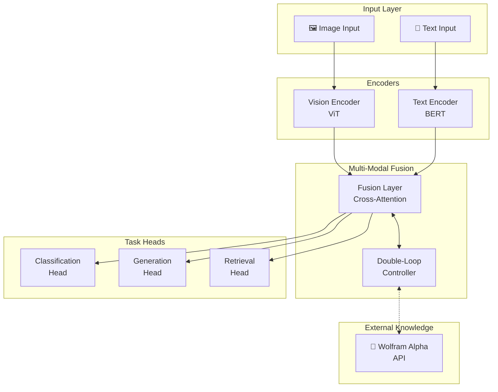
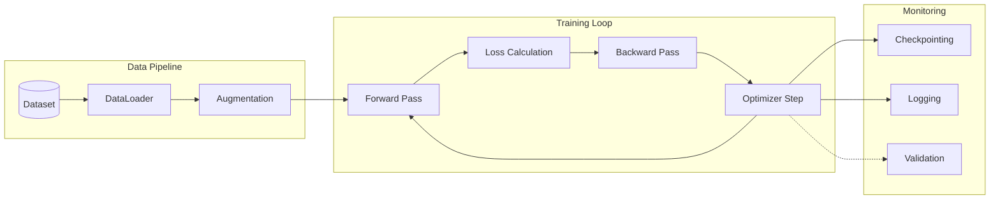
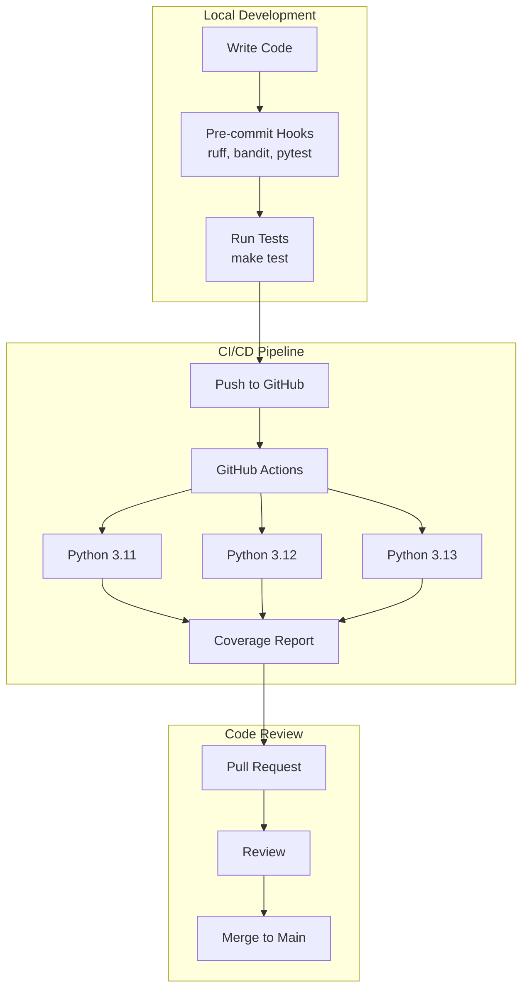

# NeuralMix — Multi-Modal Neural Network with Double-Loop Learning

[](https://opensource.org/licenses/Apache-2.0)
[](https://www.python.org/downloads/)
[](https://pytorch.org/)
[](tests/)
[](htmlcov/index.html)

> *"The first open-source multimodal model you can actually train at home — 250M parameters, consumer GPU ready, with built-in meta-learning. No cloud account required."*

NeuralMix is a **250M parameter multimodal neural network** (vision + text) that you can train end-to-end on a single consumer GPU with 12GB VRAM. It is the only open-source multimodal model at any parameter scale that is architected around **double-loop meta-learning** as a first-class feature, structurally implemented in the codebase (with training-loop wiring scheduled for Epic 2).

**Why This Project Exists:** TPS for AI in Brownfield Systems

This project is inspired by the Toyota Production System (TPS) and The Flow System, not by a quest to chase the “biggest” or “flashiest” model.

***TPS is a production philosophy built on two pillars:***

- Jidoka – automation with a human touch, stopping when abnormalities occur so defects don’t flow downstream.
- Just‑in‑Time – making only what is needed, when it is needed, and in the amount needed.

***Applied to AI in brownfield software, that leads to a few design choices:***

- We focus on eliminating waste in the software lifecycle: rework, handoffs, hunting for information, context switching, and over‑engineering AI solutions nobody uses.
- We aim for automation with a human touch: agents and multimodal models monitor and assist, but humans decide when to stop the line, investigate anomalies, and change the system.
- We prefer Just‑in‑Time intelligence over giant one‑shot generations: the system produces the smallest helpful artifact (a test, a refactor suggestion, a diagram, a summary) at the moment of need.

The Flow System extends this with a focus on complexity thinking, distributed leadership, and teams‑of‑teams. 

***This repo embraces that by:***

- Treating a brownfield codebase as a complex adaptive system, where code, docs, logs, and human conversations co‑evolve.
- Enabling different roles (dev, SRE, PO, architect) to own and shape their slice of the AI stack, rather than centralizing all “intelligence” in one place.
- Designing for modular adoption so multiple teams can move at their own pace while still sharing infrastructure and learning.

In short: this is an experiment in TPS‑inspired AI for real‑world, brownfield systems—using multimodal, agentic capabilities to remove waste, protect flow, and make work easier for the people doing it, not to replace them.

**Who is this for?**

- Independent AI developers with a 12GB+ consumer GPU (e.g., RTX 3060 12GB, RTX 4070, or 4060 Ti 16GB) who want to train a real multimodal model without a cloud bill
- Academic researchers studying meta-learning, multimodal fusion, or edge AI
- Graduate students who need a reproducible, trainable reference architecture
- Edge IoT practitioners building deploy-at-the-edge pipelines

## Why NeuralMix?

Every mature open-source multimodal model — LLaVA (7B), BLIP-2 (3.9B), InstructBLIP (8B+) — requires 24–40GB+ VRAM for training, locking out the consumer GPU class. NeuralMix is designed from the ground up for 12GB VRAM, with BF16 AMP, gradient checkpointing, and Flash Attention 2 as required features, not optional extras.

| Model | Params | Min VRAM to Train | Consumer GPU Trainable | Double-Loop | Open Source |
|-------|--------|-------------------|------------------------|-------------|-------------|
| LLaVA-7B | 7B | 40GB+ | ❌ | ❌ | ✅ |
| BLIP-2 (OPT-6.7B) | 3.9B | 24GB+ | ❌ | ❌ | ✅ |
| InstructBLIP | 8B+ | 40GB+ | ❌ | ❌ | ✅ |
| CLIP + TinyLLaMA | ~1.5B | 16–24GB | ⚠️ Limited | ❌ | ✅ |
| MobileViT (vision only) | 5–30M | 4GB | ✅ | ❌ | ✅ |
| **NeuralMix v1** | **250M** | **12GB** | **✅** | **✅** | **✅** |

## Features

- **Multi-Modal Architecture**: Vision (ViT-S) + text (BERT-Small) with early cross-modal fusion.
- **Double-Loop Learning**: LSTM meta-controller adapts learning rate and architecture signals during training — the primary research differentiator.
- **Consumer Hardware First**: BF16 AMP, gradient checkpointing, Flash Attention 2, micro-batch + gradient accumulation — all required to fit 12GB VRAM.
- **API Integration Framework**: Optional Wolfram Alpha integration for auxiliary supervision on factual/math tasks (v1.5 roadmap for training wiring).
- **Parameter Efficient**: ~180–230M parameters current implementation; 500M hard cap.
- **Full Type Safety**: Complete type annotations with mypy compliance across all source files.
- **Config-Driven Design**: YAML-first configuration with environment variable resolution.
- **Hardware Acceleration**: Automatic detection of NVIDIA (CUDA), AMD (ROCm), Apple Silicon (MPS), and NPUs.
- **External Device Support**: eGPU (Thunderbolt/USB-C) and external NPU (Coral Edge TPU, Intel Movidius NCS, Hailo AI) detection.

## Installation

### Prerequisites

- Python 3.10+
- **GPU Support (Optional)**:
  - NVIDIA: CUDA 12.1+ with RTX 3060 (12GB) or better
  - AMD: ROCm 5.7+ with RX 6700 XT (12GB) or better
  - Apple: M1/M2/M3 with Metal Performance Shaders (MPS)
- **NPU Support (Optional)**:
  - Intel AI Boost (Meteor Lake/Lunar Lake)
  - AMD Ryzen AI (7040/8040 series)
  - Apple Neural Engine (M1/M2/M3)
  - Qualcomm Hexagon NPU (Snapdragon X)
- **CPU**: Works on CPU-only systems (slower training)

### Setup

1. Clone the repository:
   ```bash
   git clone https://github.com/tim-dickey/multi-modal-neural-network.git
   cd multi-modal-neural-network
   ```

2. Create and activate virtual environment:
   ```bash
   python -m venv venv
   # Windows
   venv\Scripts\activate
   # Linux/Mac
   source venv/bin/activate
   ```

3. Install dependencies:
   ```bash
   pip install -r requirements.txt
   ```

4. (Optional) Set up development tools:
   ```bash
   # Install pre-commit hooks for code quality
   pip install pre-commit
   pre-commit install
   
   # Verify installation
   make test  # Run tests
   make lint  # Check code quality
   ```

5. (Optional) Install with Poetry:
   ```bash
   poetry install
   ```

## Quick Start

1. **Check your hardware** (detects internal and external devices):
   ```python
   # Check GPU availability (including eGPU via Thunderbolt/USB-C)
   from src.utils.gpu_utils import detect_gpu_info, print_gpu_info
   info = detect_gpu_info()
   print_gpu_info(info)
   
   # Shows: GPU count, memory, external GPU detection, connection type
   if info['external_gpu_count'] > 0:
       print(f"External GPUs detected: {info['external_gpu_count']}")
   
   # Check NPU availability (including external NPUs like Coral Edge TPU)
   from src.utils.npu_utils import detect_npu_info, print_npu_info
   npu_info = detect_npu_info()
   print_npu_info(npu_info)
   
   # Shows: NPU type, backend, internal/external status
   ```

2. Configure your environment:
   ```bash
   cp configs/default.yaml configs/my_config.yaml
   # Edit my_config.yaml with your settings
   ```

3. Set up environment variables (see [Environment Setup](#environment-setup))

4. Run the getting started notebook:
   ```bash
   jupyter notebook notebooks/01_getting_started.ipynb
   ```

5. Train the model:
   ```python
   from src.training.trainer import Trainer
   trainer = Trainer(config_path="configs/my_config.yaml")
   trainer.train()
   ```

## 📖 User Guide

For comprehensive documentation, see the **[User Guide](docs/USER_GUIDE.md)** which covers:

| Section | Description |
|---------|-------------|
| **Installation Guide** | Step-by-step setup with verification commands |
| **Configuration Guide** | Hardware, model, training, and data configuration options |
| **Hardware Detection** | Automatic GPU/NPU detection with example outputs |
| **Training Workflow** | CLI, Python API, and Jupyter notebook training methods |
| **Inference Guide** | Single and batch inference with code examples |
| **Development Tools** | Make commands, testing, linting, and type checking |
| **Troubleshooting** | Common issues (CUDA, memory, imports) with solutions |
| **Quick Reference** | Essential commands and Python API cheat sheet |

The User Guide includes Mermaid diagrams for system architecture, training pipelines, and troubleshooting flowcharts.

## 📚 Additional Documentation

| Document | Description |
|----------|-------------|
| **[Software Development Best Practices](Software%20development%20best%20practices.md)** | Coding standards, testing guidelines, and quality assurance practices |
| **[PRD Assessment](docs/PRD_ASSESSMENT.md)** | Product Requirements Document with project scope and specifications |
| **[Product Development Requirements](Open-source%20multi-modal%20small%20neural%20network%20v1.md)** | Original product development requirements and technical specifications |

## Environment Setup

Create a `.env` file in the project root with your API keys:

```bash
# Copy the example file
cp .env.example .env

# Edit .env with your actual keys
# WOLFRAM_API_KEY=your_wolfram_alpha_api_key_here
# OPENAI_API_KEY=your_openai_api_key_here  # For future integrations
```

**Important**: Never commit `.env` files to version control. They are automatically ignored by `.gitignore`.

## Project Structure

```
multi-modal-neural-network/
├── README.md
├── LICENSE
├── requirements.txt
├── pyproject.toml
├── train.py                        # Training entry point
├── inference.py                    # Inference script
├── .env.example                    # Environment variable template
├── configs/
│   └── default.yaml               # Default configuration
├── src/
│   ├── models/                    # Core model components (fully typed)
│   │   ├── multi_modal_model.py   # Top-level model composition
│   │   ├── vision_encoder.py      # ViT-S vision encoder (~50M params)
│   │   ├── text_encoder.py        # BERT-Small text encoder (~50M params)
│   │   ├── fusion_layer.py        # Early cross-modal fusion (~50M params)
│   │   ├── double_loop_controller.py  # LSTM meta-controller (~10–15M params)
│   │   └── heads.py               # Task heads (classification, contrastive, etc.)
│   ├── training/                  # Training infrastructure
│   │   ├── trainer.py             # Main Trainer class
│   │   ├── optimizer.py           # AdamW + adaptive LR controller
│   │   ├── losses.py              # Task + meta + contrastive losses
│   │   ├── checkpoint_manager.py  # .pt + safetensors dual save
│   │   └── training_state.py      # State, logging, component factory
│   ├── data/                      # Data pipeline
│   │   ├── dataset.py             # MultiModal, COCO, ImageNet datasets
│   │   └── selector.py            # Multi-dataset assembly
│   ├── integrations/              # External API framework
│   │   ├── base.py                # Abstract base with retry logic
│   │   ├── wolfram_alpha.py       # Wolfram Alpha (v1.5: wired to training loss)
│   │   ├── validators.py          # Response validation
│   │   └── knowledge_injection.py # Knowledge injection logic
│   ├── evaluation/                # Evaluation (Phase 7 — not yet built)
│   └── utils/                     # Utilities
│       ├── config.py              # YAML config + env var resolution
│       ├── gpu_utils.py           # GPU/eGPU detection
│       └── npu_utils.py           # NPU detection and configuration
├── notebooks/
│   ├── 01_getting_started.ipynb   # Setup and forward pass (content pending)
│   ├── 02_training.ipynb          # Training workflow (content pending)
│   └── 03_evaluation.ipynb        # Evaluation (content pending)
├── tests/                         # 20 test files, 93% coverage
└── docs/
    ├── ARCHITECTURE.md            # Component architecture and ADRs
    ├── ROADMAP.md                 # Version roadmap v1 → v1.5 → v2
    ├── GPU_TRAINING.md            # GPU configuration guide
    └── NPU_TRAINING.md            # NPU inference and edge deployment
```

## Known Limitations (v1)

NeuralMix v1 is a research platform, not a production deployment. The following features are **structurally implemented but not yet functionally active** in the training loop:

| Feature | Status | Impact |
|---------|--------|--------|
| **Double-loop meta-controller** | Structurally wired; not yet called from `train_epoch()` | Controller produces no effect during training until Epic 2 is complete |
| **BF16 AMP** | Configured in YAML; `autocast` and `GradScaler` not yet applied in training loop | Full-precision training only until Epic 1 is complete |
| **Flash Attention 2** | Not yet implemented; standard `q @ k.T` used | Higher VRAM usage than target 11.5GB ceiling |
| **Gradient checkpointing** | Config flag exists; `torch.utils.checkpoint` not applied | Higher activation memory until Epic 1 is complete |
| **Wolfram Alpha training integration** | Compiles and runs; not wired into training loss | Deferred to v1.5 |
| **Evaluation module** | `src/evaluation/` is empty | No benchmark results until Epic 4 is complete |
| **Jupyter notebook content** | Shell files exist; content not yet built | No interactive tutorials until Epic 5 |

See [docs/ARCHITECTURE.md](docs/ARCHITECTURE.md) for full implementation status by phase.

## Implementation Status

NeuralMix is a **brownfield project** midway through its 9-phase development plan. Phases 1–5 are structurally complete; Phases 6–9 are in progress.

| Phase | Description | Status |
|-------|-------------|--------|
| 1 | Environment setup, base architecture, tests | ✅ Complete |
| 2 | Vision encoder, text encoder, fusion layer | ✅ Complete |
| 3 | Double-loop controller (structural) | ✅ Structural complete |
| 3b | Double-loop wired to training loop | 🔲 Epic 2 |
| 4 | Wolfram Alpha integration (structural) | ✅ Structural complete |
| 4b | Wolfram wired to training loss | ⏭️ v1.5 scope |
| 5 | BF16 AMP (configured) | ⚠️ Configured, not applied |
| 5b | Flash Attention 2 | 🔲 Epic 1 |
| 5c | Gradient checkpointing (flag exists) | ⚠️ Flag exists, not applied |
| 6 | Full training run | 🔲 Epic 3 |
| 7 | Evaluation / benchmarks | 🔲 Epic 4 |
| 8 | Documentation + tutorials | 🔲 Epic 5 |
| 9 | Public release | 🔲 Epic 6 |

## Architecture Overview

### Model Architecture



### Training Pipeline



### Development Workflow



## API Integration Framework

The project includes a flexible API integration framework designed for external knowledge sources:

### Current Integrations

- **Wolfram Alpha**: Symbolic computation and mathematical verification
  - API key required: `WOLFRAM_API_KEY`
  - Used for ground truth validation and computational knowledge injection

### Future Integrations

The framework is designed to easily accommodate additional APIs:

- **OpenAI GPT**: Text generation and reasoning augmentation
- **Google PaLM**: Multimodal understanding enhancement
- **Hugging Face Inference**: Specialized model access
- **Custom APIs**: Domain-specific knowledge sources

### Adding New API Integrations

1. Create a new module in `src/integrations/`:
   ```python
   # src/integrations/new_api.py
   from src.integrations.base import APIIntegration

   class NewAPIIntegration(APIIntegration):
       def __init__(self, api_key: str, config: dict):
           super().__init__(api_key, config)

       def query(self, prompt: str) -> dict:
           # Implementation here
           pass
   ```

2. Add configuration to `configs/default.yaml`:
   ```yaml
   new_api:
     api_key: "${NEW_API_KEY}"
     endpoint: "https://api.example.com"
     timeout: 30
   ```

3. Update environment variables in `.env.example`

## Configuration

The model is configured via YAML files in the `configs/` directory. Key parameters include:

- Model architecture (layer counts, dimensions, heads)
- Training hyperparameters (learning rates, batch sizes)
- Double-loop controller settings
- API integration configurations
- Hardware optimization settings

See `configs/default.yaml` for a complete example.

### Hardware Configuration

The system automatically detects and configures available hardware accelerators. Configure in `configs/default.yaml`:

```yaml
hardware:
  device: "auto"        # Auto-detect best device
  # OR specify manually:
  # device: "cuda"      # NVIDIA GPU
  # device: "mps"       # Apple Silicon
  # device: "npu"       # Neural Processing Unit
  # device: "cpu"       # CPU fallback
  
  gpu_id: null          # Specify GPU index for multi-GPU systems (e.g., 0, 1)
  prefer_npu: false     # Prefer NPU over GPU when both available
```

**Device Options:**
- `"auto"`: Automatically selects the best available device (GPU > NPU > CPU)
- `"cuda"` or `"cuda:0"`: NVIDIA GPU (specify index for multi-GPU)
- `"mps"`: Apple Silicon Neural Engine
- `"npu"`: Generic NPU (Intel AI Boost, AMD Ryzen AI, etc.)
- `"openvino"`: Intel AI Boost via OpenVINO
- `"ryzenai"`: AMD Ryzen AI
- `"cpu"`: CPU-only mode

**Hardware Detection (includes external devices):**
```python
from src.utils.gpu_utils import detect_gpu_info
from src.utils.npu_utils import check_accelerator_availability, get_best_available_device

# Detect all GPUs (internal + external eGPU)
gpu_info = detect_gpu_info()
print(f"Total GPUs: {gpu_info['device_count']}")
print(f"External GPUs: {gpu_info['external_gpu_count']}")

# Check what accelerators are available
availability = check_accelerator_availability()
print(f"CUDA (NVIDIA GPU): {availability['cuda']}")
print(f"MPS (Apple Silicon): {availability['mps']}")
print(f"NPU (Internal/External): {availability['npu']}")

# Get recommended device
device = get_best_available_device(prefer_npu=False)
print(f"Recommended: {device}")
```

**External Device Support:**
- **External GPUs (eGPU)**: Automatically detected via Thunderbolt 3/4, USB-C, or external PCIe
  - Shows connection type and performance characteristics
  - Works with all major eGPU enclosures (Razer Core, Sonnet, Akitio, etc.)
- **External NPUs**: Detects USB/PCIe AI accelerators
  - Google Coral Edge TPU (USB/M.2/PCIe)
  - Intel Movidius Neural Compute Stick 2
  - Hailo-8 AI Accelerator (PCIe)

For detailed hardware setup guides:
- **GPU Training**: See [docs/GPU_TRAINING.md](docs/GPU_TRAINING.md) - includes eGPU setup
- **NPU Training**: See [docs/NPU_TRAINING.md](docs/NPU_TRAINING.md) - includes external NPU setup

## Dataset Selection

You can assemble training/validation/test sets from multiple datasets declaratively in `configs/default.yaml` using the `data.datasets` list. Example:

```yaml
data:
  batch_size: 32
  num_workers: 4
  pin_memory: true
  datasets:
    - name: multimodal_core
      type: multimodal
      data_dir: ./data/multimodal
      splits: {train: 0.8, val: 0.1, test: 0.1}
      enabled: true
    - name: captions_aux
      type: coco_captions
      root: ./data/coco/images
      ann_file: ./data/coco/annotations/captions_train2017.json
      splits: {train: 1.0}
      use_in: [train]
      enabled: true
```

Key fields:

- `type`: One of `multimodal`, `coco_captions`, `imagenet` (mapped to internal dataset classes).
- `splits`: Mapping of split name to ratio; must sum to 1.0. Omit for implicit `{train: 1.0}`.
- `use_in`: Optional restriction of which splits this dataset contributes to.
- `enabled`: Toggle inclusion without deleting entry.

Disable a dataset:

```yaml
    - name: captions_aux
      type: coco_captions
      # ...
      enabled: false
```

Programmatic usage inside notebooks or scripts:

```python
from src.utils.config import load_config
from src.data import build_dataloaders

config = load_config("configs/default.yaml")
train_loader, val_loader, test_loader = build_dataloaders(config)
print(len(train_loader), len(val_loader or []), len(test_loader or []))
```

If `data.datasets` is present, the `Trainer` automatically uses the selector; otherwise it falls back to legacy single-dataset keys (`train_dataset`, `val_dataset`).

## Training

### Hardware Requirements

**Minimum (GPU Training):**
- GPU: NVIDIA RTX 3060 12GB or AMD RX 6700 XT 12GB
- CPU: 6-core / 12-thread
- RAM: 16GB

**Recommended (GPU Training):**
- GPU: NVIDIA RTX 4070 12GB or RTX 3080 16GB
- CPU: 8-core / 16-thread
- RAM: 32GB

**CPU-Only Training:**
- CPU: 8-core / 16-thread or better
- RAM: 32GB+
- Note: Training will be significantly slower (10-50x)

**NPU Inference (After Training):**
- NPU: Intel AI Boost, AMD Ryzen AI, Apple Neural Engine, or Qualcomm Hexagon
- RAM: 16GB+
- Note: NPUs are optimized for inference, not training. Train on GPU/CPU, then export to ONNX for NPU deployment.

**External Device Training/Inference:**
- eGPU: Any desktop GPU in Thunderbolt 3/4 or USB-C enclosure
  - Thunderbolt bandwidth: 40 Gbps (expect 10-25% slower than internal)
  - Supports both training and inference
- External NPU: Coral Edge TPU, Intel Movidius NCS2, Hailo-8
  - USB 3.0/PCIe connection
  - Inference only (export to ONNX/TFLite first)
  - Ideal for prototyping edge deployments

### Supported Hardware

**NVIDIA GPUs (CUDA):**
- RTX 40 Series: 4090, 4080, 4070 (Ada Lovelace)
- RTX 30 Series: 3090, 3080, 3070, 3060 (Ampere)
- RTX 20 Series: 2080 Ti, 2070 (Turing)
- GTX 16 Series: 1660 Ti (Turing)
- Data Center: A100, A40, V100, T4

**AMD GPUs (ROCm):**
- RX 7000 Series: 7900 XTX, 7900 XT (RDNA 3)
- RX 6000 Series: 6900 XT, 6800 XT, 6700 XT (RDNA 2)
- Instinct: MI250, MI100

**Apple Silicon (MPS):**
- M3 Max, M3 Pro, M3
- M2 Ultra, M2 Max, M2 Pro, M2
- M1 Ultra, M1 Max, M1 Pro, M1

**Internal NPUs (Inference):**
- Intel: AI Boost (Meteor Lake, Lunar Lake) - ~10 TOPS
- AMD: Ryzen AI (Phoenix, Hawk Point) - ~10-16 TOPS
- Apple: Neural Engine (M1/M2/M3) - up to 15.8 TOPS
- Qualcomm: Hexagon NPU (Snapdragon X Elite/Plus) - ~45 TOPS

**External NPUs (Inference):**
- Google Coral Edge TPU (USB/M.2/PCIe) - 4 TOPS, ~$25-75
- Intel Movidius Neural Compute Stick 2 (USB) - ~1 TOPS, ~$70-100
- Hailo-8 AI Accelerator (PCIe/M.2) - 26 TOPS, ~$200-300

**External GPUs (eGPU Enclosures):**
- Thunderbolt 3/4: Razer Core X, Sonnet eGFX, Akitio Node
- Compatible with any desktop GPU (NVIDIA/AMD)
- Expect 10-25% performance reduction vs internal GPU

### Training Command

```bash
python -m src.training.trainer --config configs/default.yaml
```

Training requires a complete dataset assembly (see [Dataset Selection](#dataset-selection) and [docs/ARCHITECTURE.md](docs/ARCHITECTURE.md) §6 for supported dataset types).

## Evaluation

Run benchmarks:
```bash
python -m src.evaluation.benchmarks --config configs/default.yaml
```

Compare with API knowledge:
```bash
python -m src.evaluation.api_comparison --config configs/default.yaml
```

## Development

### Type Safety

The codebase maintains **complete type safety** with comprehensive mypy integration. All 23 source files pass strict static type checking with zero type errors.

#### Type Checking Features
- **Strict mypy Configuration**: Python 3.10+ support with comprehensive type checking rules
- **Complete Type Coverage**: 100% type annotations across the entire codebase
- **Type Stubs**: Full type stub support for all major dependencies (PyTorch, Transformers, etc.)
- **Protocol Usage**: Proper typing protocols for interface definitions and polymorphism
- **Generic Types**: Extensive use of Union, Optional, Dict, and custom generic types

#### Type Safety Benefits
- **Runtime Reliability**: Prevents type-related runtime errors through static analysis
- **Enhanced IDE Support**: Full IntelliSense, autocomplete, and refactoring capabilities
- **Documentation**: Type annotations serve as inline documentation for function signatures
- **Maintainability**: Easier code maintenance and refactoring with type guarantees
- **Developer Experience**: Better error messages and debugging capabilities

#### Running Type Checks
```bash
# Check entire codebase
mypy src/ --show-error-codes

# Check specific file
mypy src/models/multi_modal_model.py --show-error-codes

# Use cache for faster subsequent runs
mypy src/ --cache-dir /tmp/mypy_cache --show-error-codes
```

#### Type Checking Configuration
The type checking is configured in `pyproject.toml` with strict settings including:
- `disallow_untyped_defs`: All functions must have type annotations
- `disallow_incomplete_defs`: All parameters must be typed
- `no_implicit_optional`: Optional types must be explicit
- `warn_return_any`: Any return types are flagged as warnings
- `strict_equality`: Strict type equality checking

### Testing

Run the test suite:
```bash
# Quick test run (using make)
make test

# Run all tests with coverage
make test-cov

# Run tests with pytest directly
pytest tests/

# Run with coverage report
pytest --cov=src --cov-report=term-missing

# Run integration tests
pytest tests/test_integration.py -v
```

**Test Coverage:** The project maintains **93% test coverage** (446 tests) across all modules.

### Code Quality

We use automated code quality tools with pre-commit hooks:

```bash
# Install pre-commit hooks (one-time setup)
pip install pre-commit
pre-commit install

# Run all quality checks
make lint

# Format code (using make)
make format

# Manual formatting
black src/ tests/
isort src/ tests/

# Lint code
ruff check src/ tests/
flake8 src/ tests/

# Security scan
bandit -r src/
```

### CI/CD

The project uses GitHub Actions for continuous integration:
- **Multi-version testing**: Python 3.11, 3.12, 3.13
- **Coverage reporting**: Automatic coverage reports on PRs
- **Dependency caching**: Fast CI builds with pip caching

## Roadmap

See [docs/ROADMAP.md](docs/ROADMAP.md) for the full version roadmap.

| Version | Goal | Key Features |
|---------|------|--------------|
| **v1** (current) | Experimental research platform | 250M params, consumer GPU training, double-loop meta-learning, research publication target |
| **v1.5** | Production-ready progression | INT8 quantization, ONNX export, stable Python API, Wolfram Alpha training wiring, HuggingFace-compatible interface |
| **v2** | Edge / IoT production target | ARM Cortex-M, Jetson, Raspberry Pi 5 targets; 10M/50M/100M tiers; full online adaptation for distribution shift |

**v1 success criteria:** Preprint accepted or 50+ citations/views; 100+ GitHub stars in 90 days; double-loop ablation showing ≥5% accuracy improvement documented.

## Contributing

We welcome contributions! Please see our [Contributing Guide](CONTRIBUTING.md) for details.

### Development Setup

1. Fork the repository
2. Create a feature branch
3. Make your changes with full type annotations
4. Add tests for new functionality
5. Ensure all tests pass and type checking succeeds
6. Submit a pull request

## License

This project is licensed under the Apache License 2.0 - see the [LICENSE](LICENSE) file for details.

## Citation

If you use this code in your research, please cite:

```
@misc{multi-modal-neural-network,
  title={Multi-Modal Neural Network with Double-Loop Learning},
  author={Tim Dickey},
  year={2025},
  url={https://github.com/tim-dickey/multi-modal-neural-network}
}
```

## Acknowledgments

- Built with PyTorch and Hugging Face Transformers
- Wolfram Alpha for symbolic computation (optional auxiliary supervision)
- Community contributors
- Architecture inspired by the edge IoT deployment challenge: training where the model needs to live
