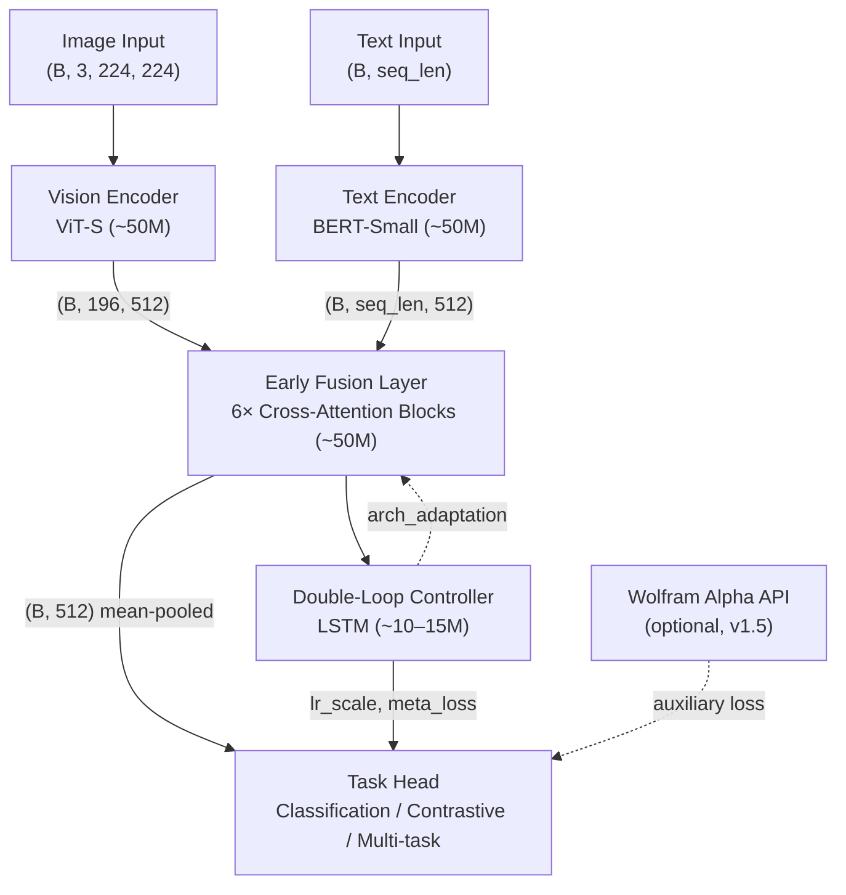
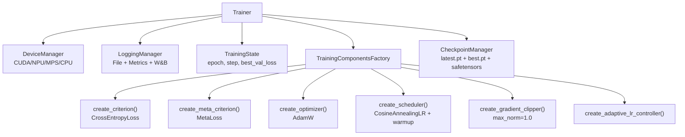

# NeuralMix — Architecture

**Version:** 1.0
**Date:** 2026-03-03
**Status:** Approved

## Table of Contents

- [1. Architecture Overview](#1-architecture-overview)
- [2. Component Architecture](#2-component-architecture)
- [3. Training System Architecture](#3-training-system-architecture)
- [4. Architecture Decision Records](#4-architecture-decision-records)
- [5. Module Interface Contracts](#5-module-interface-contracts)
- [6. Data Architecture](#6-data-architecture)
- [7. Configuration Reference](#7-configuration-reference)
- [8. Security and Safety](#8-security-and-safety)
- [9. Implementation Status](#9-implementation-status)

---

## 1. Architecture Overview

NeuralMix is a **250M parameter multimodal neural network** combining a Vision Transformer (ViT) encoder, a BERT-style text encoder, an early fusion layer, a double-loop meta-learning controller, and configurable task heads. The system is designed to train end-to-end on a single consumer GPU (12GB VRAM) using BF16 AMP, gradient checkpointing, and Flash Attention 2.

### 1.1 Parameter Budget

| Component | Target | Maximum | Current Implementation |
|-----------|--------|---------|------------------------|
| Vision Encoder | 50M | 100M | ~50M (12L × 8H × 512D) |
| Text Encoder | 50M | 100M | ~50M (12L × 8H × 512D) |
| Fusion Layer | 50M | 100M | ~50M (6L × 8H × 512D) |
| Task Heads | 25M | 50M | ~2–5M (classification default) |
| Double-Loop Controller | 25M | 50M | ~10–15M (LSTM 2L × 256H) |
| **Total** | **200–250M** | **500M** | **~180–230M** |

### 1.2 High-Level Data Flow



---

## 2. Component Architecture

### 2.1 Vision Encoder (`src/models/vision_encoder.py`)

**Architecture:** Vision Transformer Small (ViT-S)

```
Input: (B, 3, 224, 224)
  │
  ▼ PatchEmbedding (Conv2d 16×16 stride 16)
  │ → (B, 196, 512)   [196 = (224/16)²]
  │
  ▼ Prepend CLS token → (B, 197, 512)
  │
  ▼ Add learnable position embeddings (197 × 512)
  │
  ▼ Dropout
  │
  ▼ 12× TransformerBlock
  │   ├─ LayerNorm (pre-norm)
  │   ├─ MultiHeadAttention (8 heads, head_dim=64)
  │   ├─ Residual
  │   ├─ LayerNorm (pre-norm)
  │   ├─ MLP (512 → 2048 → 512, GELU)
  │   └─ Residual
  │
  ▼ LayerNorm
  │
  ▼ Split: CLS token (B, 512) + patch tokens (B, 196, 512)
```

**Key design decisions:**

- Pre-norm style (LayerNorm before attention) — more stable training than post-norm
- CLS token for classification tasks; patch tokens for cross-modal attention
- Truncated-normal initialization (std=0.02) — standard ViT init

**Outstanding work:**

- Replace standard `q @ k.T` attention with `torch.nn.functional.scaled_dot_product_attention` (Flash Attention backend) — required to meet the 11.5GB VRAM target (Epic 1, Story 1.3)
- Implement `get_attention_maps()` for interpretability figures (raises `NotImplementedError` currently)

---

### 2.2 Text Encoder (`src/models/text_encoder.py`)

**Architecture:** BERT-Small

```
Input: input_ids (B, seq_len), attention_mask (B, seq_len), token_type_ids (B, seq_len)
  │
  ▼ TextEmbedding
  │   ├─ Token embeddings (30522 vocab × 512)
  │   ├─ Position embeddings (512 positions × 512)
  │   ├─ Segment embeddings (2 × 512)
  │   └─ LayerNorm + Dropout
  │   → (B, seq_len, 512)
  │
  ▼ 12× TextTransformerBlock (pre-norm style)
  │
  ▼ LayerNorm
  │
  ▼ CLS pooler: Linear(512, 512) + Tanh → CLS token (B, 512)
  ▼ Full sequence: (B, seq_len, 512)
```

**Key design decisions:**

- BERT vocabulary size (30522) for compatibility with `bert-base-uncased` tokenizer
- Segment embeddings (token_type_ids) for sentence-pair tasks
- `SimpleTokenizer` (character-level) is a **research placeholder** — must be replaced with `AutoTokenizer.from_pretrained("bert-base-uncased")` before any accuracy benchmarking (Epic 1, Story 1.4)

---

### 2.3 Fusion Layer (`src/models/fusion_layer.py`)

**Architecture:** Early Fusion with Alternating Cross-Modal Attention

```
Inputs:
  vision_features: (B, 196, 512)
  text_features:   (B, seq_len, 512)
  text_mask:       (B, seq_len)
  │
  ▼ Linear projection + modality-type embeddings (learnable, 2 × 512)
  │
  ▼ Concatenate: (B, 196+seq_len, 512)
  │
  ▼ 6× FusionTransformerBlock (alternating):
  │   Even blocks (i=0,2,4): vision attends to text
  │   Odd blocks  (i=1,3,5): text attends to vision
  │
  ▼ LayerNorm
  │
  ▼ Mean pool over full sequence → (B, 512)
```

**Key design decisions:**

- Early fusion chosen over late fusion: stronger cross-modal interaction from early layers at comparable parameter cost
- Alternating attention strategy: each modality progressively integrates from the other
- Modality-type embeddings distinguish vision tokens from text tokens post-concatenation

**Outstanding work:**

- Combined attention mask is commented out — text padding tokens can corrupt vision cross-attention; must be implemented before accuracy benchmarking (Epic 1, Story 1.3)

---

### 2.4 Double-Loop Controller (`src/models/double_loop_controller.py`)

**Architecture:** LSTM Meta-Controller

```
Inputs (every N steps, where N=update_frequency):
  model_features:  (B, 512)  — pooled fusion output, detached
  loss:            (B, 1)    — current training loss
  accuracy:        (B, 1)    — current batch accuracy
  gradient_norm:   (B, 1)    — L2 norm of all model gradients
  │
  ▼ Concatenate → (B, 515) → unsqueeze → (B, 1, 515)
  │
  ▼ 2-layer LSTM (hidden_dim=256)
  │   Maintains rolling hidden state across training steps
  │
  ├─▶ lr_modulator:       → lr_scale: (B, 1) ∈ [0, 1]
  ├─▶ arch_predictor:     → arch_adaptation: (B, 64)
  └─▶ meta_loss_predictor → meta_loss: (B, 1)
```

**Inner loop (standard gradient descent):** AdamW on task loss, update every batch.

**Outer loop (meta-learning):** LSTM controller processes training history every `update_frequency` steps (default 100), outputs `lr_scale` → scales optimizer LR via `AdaptiveLRController`.

**⚠️ Current gap:** `train_epoch()` does not pass `current_loss`, `current_accuracy`, or `gradient_norm` to the model forward pass. The controller is structurally wired but produces no effect during training. Fix required in Epic 2, Story 2.1.

---

### 2.5 Task Heads (`src/models/heads.py`)

| Head Type | Config key | Primary use |
|-----------|-----------|-------------|
| `ClassificationHead` | `classification` | CIFAR-100, ImageNet |
| `RegressionHead` | `regression` | Continuous output tasks |
| `MultiLabelHead` | `multilabel` | Multi-label classification (COCO) |
| `ContrastiveHead` | `contrastive` | Image-text matching (CLIP-style) |
| `SequenceGenerationHead` | `generation` | Captioning (Phase 2+, `NotImplementedError` for inference) |
| `MultiTaskHead` | `multitask` | Combines multiple heads |

**Default config:** Classification with 1000 classes.

**For research targets:**

- Phase 1 evaluation: `ClassificationHead` (CIFAR-100 target: 75–80%)
- Contrastive pre-training: `ContrastiveHead` (image-text matching)
- VQA evaluation: `ClassificationHead` with VQA answer vocabulary (target: 50–55%)

---

### 2.6 Wolfram Alpha Integration (`src/integrations/`)

**Status: Structurally implemented, not connected to training loop. Wiring deferred to v1.5.**


Neither `WolframAlphaIntegration` nor `WolframKnowledgeInjector` is instantiated in `trainer.py` or `losses.py` in v1. The Wolfram API key (`${WOLFRAM_API_KEY}`) is configured via environment variable and the integration compiles cleanly as a fallback-safe module.

---

## 3. Training System Architecture

### 3.1 Component Interaction



### 3.2 Target Training Loop (Phase 6)

```python
for epoch in range(max_epochs):
    for batch in train_loader:
        optimizer.zero_grad()

        with torch.amp.autocast(device_type='cuda', dtype=torch.bfloat16):
            outputs = model(
                images=batch['images'],
                input_ids=batch['input_ids'],
                attention_mask=batch['attention_mask'],
                current_loss=prev_loss,
                current_accuracy=prev_accuracy,
                gradient_norm=prev_grad_norm,
            )
            logits = outputs['logits']
            task_loss = criterion(logits, batch['labels'])
            meta_info = outputs.get('meta_info')
            total_loss = meta_criterion(task_loss, meta_info)

        scaler.scale(total_loss).backward()
        scaler.unscale_(optimizer)
        grad_norm = grad_clipper(model.parameters())
        scaler.step(optimizer)
        scaler.update()

        if meta_info and adaptive_lr:
            adaptive_lr.update_lr(optimizer, meta_info['lr_scale'])

        prev_loss = task_loss.detach()
        prev_accuracy = (logits.argmax(-1) == batch['labels']).float().mean().detach()
        prev_grad_norm = torch.tensor(grad_norm)

    scheduler.step()
```

### 3.3 Memory Budget (12GB VRAM target)

| Component | VRAM Estimate |
|-----------|---------------|
| Model parameters (BF16) | ~460MB |
| Optimizer states (FP32) | ~920MB |
| Activations (micro_batch=4, grad_checkpoint) | ~4–6GB |
| Gradients (BF16) | ~460MB |
| Data buffers | ~500MB |
| Flash Attention overhead | ~200MB |
| **Total (estimated)** | **~7–8.5GB** |
| **Peak (with accumulation)** | **~10–11GB** |
| **VRAM ceiling** | **11.5GB** |

Memory optimizations required (all must be active before Phase 6 training run):

1. BF16 AMP — halves activation and gradient memory
2. Gradient checkpointing — reduces activation memory ~30–40%
3. Flash Attention 2 — reduces attention memory from O(N²) to O(N)
4. Micro-batch size 4 with gradient accumulation 8 — effective batch 32

---

## 4. Architecture Decision Records

### ADR-001: Early Fusion (Type-C) over Late Fusion

**Decision:** Use early fusion with alternating cross-modal attention blocks.

**Rationale:** Late fusion requires two full forward passes before cross-modal interaction. Early fusion allows each modality to attend to the other from the fusion layer onward, producing richer cross-modal representations at comparable parameter cost. Parameter count: ~50M for 6-layer fusion transformer vs. ~50M for a late-fusion projection network.

**Trade-off accepted:** Early fusion is less interpretable per-modality. For Phase 1 research, interpretability is secondary to performance.

---

### ADR-002: Custom ViT + BERT over Pre-trained Backbones

**Decision:** Implement ViT-S and BERT-Small from scratch rather than loading pre-trained HuggingFace weights.

**Rationale:** The PRD goal is training from scratch on consumer hardware. Loading CLIP/BERT weights defeats the research purpose. Custom implementation allows architectural modifications (e.g., adding `AdaptiveLayerNorm` for double-loop).

**Trade-off accepted:** Training from scratch requires more compute and data than fine-tuning.

---

### ADR-003: LSTM-based Meta-Controller over Transformer-based

**Decision:** Use a 2-layer LSTM for the double-loop meta-controller.

**Rationale:** LSTM maintains a rolling hidden state naturally — meta-learning requires memory of training history across many steps. At 256 hidden units, the LSTM is ~10–15M parameters, fitting within the 25M controller budget. Update frequency of 100 steps means low computational overhead.

**Trade-off accepted:** LSTM cannot attend back to arbitrary points in training history. Acceptable for v1.

---

### ADR-004: Apache 2.0 License

**Decision:** Apache 2.0.

**Rationale:** Patent grant protects community contributors from patent claims. More permissive for commercial-adjacent use than GPL/LGPL. Preferred by enterprise adopters.

---

### ADR-005: Wolfram Alpha as Optional Auxiliary Signal — v1.5 Wiring

**Decision:** Wolfram Alpha validation loss at 15% weight, with graceful fallback. **Wiring to training loop deferred to v1.5.**

**Rationale:** The core v1 research claim is double-loop meta-learning, not Wolfram knowledge injection. Over-weighting the Wolfram signal risks teaching the model to optimise for Wolfram queries rather than multimodal understanding. Deferring to v1.5 keeps v1 scope focused on the primary research contribution.

---

### ADR-006: Single-GPU Training (No DDP in v1)

**Decision:** Target single RTX 3060 12GB. DDP config flag exists but disabled.

**Rationale:** Target user profile is independent developer with one GPU. DDP adds implementation complexity disproportionate to research value at 250M params. v1.5 can introduce DDP for multi-GPU fine-tuning.

---

## 5. Module Interface Contracts

### 5.1 `VisionEncoder.forward(x)`

```
Input:  x: torch.Tensor  shape=(B, 3, H, W)  dtype=float32|bfloat16
Output: Tuple[
    cls_token:     torch.Tensor  shape=(B, hidden_dim),
    patch_tokens:  torch.Tensor  shape=(B, n_patches, hidden_dim)
]
```

### 5.2 `TextEncoder.forward(input_ids, attention_mask, token_type_ids)`

```
Input:
    input_ids:       torch.Tensor  shape=(B, seq_len)  dtype=int64
    attention_mask:  torch.Tensor  shape=(B, seq_len)  dtype=int64  (1=real, 0=pad)
    token_type_ids:  Optional[torch.Tensor]  shape=(B, seq_len)
Output: Tuple[
    cls_token:        torch.Tensor  shape=(B, hidden_dim),
    sequence_output:  torch.Tensor  shape=(B, seq_len, hidden_dim)
]
```

### 5.3 `FusionLayer.forward(...)`

```
Input:
    vision_features: torch.Tensor  shape=(B, n_patches, hidden_dim)
    text_features:   torch.Tensor  shape=(B, seq_len, hidden_dim)
    text_mask:       Optional[torch.Tensor]  shape=(B, seq_len)
Output: Tuple[
    fused_features:  torch.Tensor  shape=(B, n_patches+seq_len, hidden_dim)  [early]
                                    OR  shape=(B, hidden_dim)  [late]
    vision_seq_len:  Optional[int]
]
```

### 5.4 `DoubleLoopController.forward(...)`

```
Input:
    model_features:  torch.Tensor  shape=(B, model_hidden_dim)  [detached]
    loss:            torch.Tensor  shape=(B,) or scalar
    accuracy:        torch.Tensor  shape=(B,) or scalar
    gradient_norm:   torch.Tensor  shape=(B,) or scalar
Output: Dict[
    "lr_scale":           torch.Tensor  shape=(B, 1)  ∈ [0, 1]
    "arch_adaptation":    torch.Tensor  shape=(B, 64)
    "meta_loss":          torch.Tensor  shape=(B, 1)
    "should_update_meta": bool
]
```

### 5.5 `MultiModalModel.forward(...)`

```
Input:
    images:           Optional[torch.Tensor]  shape=(B, 3, H, W)
    input_ids:        Optional[torch.Tensor]  shape=(B, seq_len)
    attention_mask:   Optional[torch.Tensor]  shape=(B, seq_len)
    token_type_ids:   Optional[torch.Tensor]  shape=(B, seq_len)
    current_loss:     Optional[torch.Tensor]  — for double-loop
    current_accuracy: Optional[torch.Tensor]  — for double-loop
    gradient_norm:    Optional[torch.Tensor]  — for double-loop
    return_features:  bool  (default False)
    task_name:        Optional[str]  — for MultiTaskHead routing
Output: Dict[
    "logits":    torch.Tensor  — task predictions
    "meta_info": Optional[Dict]  — double-loop controller outputs
    "features":  Optional[Dict]  — if return_features=True
]
```

### 5.6 `Trainer.train_epoch(epoch)`

```
Input:   epoch: int
Output:  Dict["loss": float, "accuracy": float]
Side effects: optimizer step, scheduler step, checkpoint save
```

---

## 6. Data Architecture

### 6.1 Dataset Registry

| Type key | Class | Use |
|----------|-------|-----|
| `multimodal` | `MultiModalDataset` | Generic JSON-annotated vision+text |
| `coco_captions` | `COCOCaptionsDataset` | MS-COCO caption pairs |
| `imagenet` | `ImageNetDataset` | ImageNet-style class directories |

### 6.2 Multi-Dataset Assembly (`selector.py`)

```yaml
data:
  datasets:
    - name: multimodal_core
      type: multimodal
      data_dir: ./data/multimodal
      splits: {train: 0.8, val: 0.1, test: 0.1}
      enabled: true
    - name: captions_aux
      type: coco_captions
      root: ./data/coco/images
      ann_file: ./data/coco/annotations/captions_train2017.json
      splits: {train: 1.0}
      use_in: [train]
      enabled: true
```

`build_dataloaders()` assembles `ConcatDataset` per split from all enabled, applicable entries.

### 6.3 Target Training Data

| Dataset | Size | Split | Status |
|---------|------|-------|--------|
| Conceptual Captions / COCO | 100k–500k multimodal pairs | Primary train | Loader implemented (COCO) |
| ImageNet-1k subset | 50k–100k images | Vision pretraining | Loader implemented |
| Wikipedia / OpenWebText subset | 50k–100k texts | Text pretraining | Not implemented |
| Natural Questions / TriviaQA / SciQ | 10k–25k | Wolfram validation | Not implemented (v1.5) |
| GSM8K / MATH subset | 5k–15k | Math reasoning | Not implemented (v1.5) |

---

## 7. Configuration Reference

All configuration via `configs/default.yaml`. Key sections:

```yaml
model:
  vision_encoder:
    hidden_dim: 512
    num_layers: 12
    num_heads: 8
  text_encoder:
    vocab_size: 30522
    max_seq_length: 512
  fusion:
    type: early
    num_layers: 6
  double_loop:
    controller_type: lstm
    update_frequency: 100
    meta_lr: 1e-5

training:
  inner_lr: 3e-4
  max_epochs: 50
  mixed_precision: bf16
  gradient_checkpointing: true
  micro_batch_size: 4
  gradient_accumulation: 8

hardware:
  device: auto
  max_memory: "11GB"
```

---

## 8. Security and Safety

| Concern | Implementation |
|---------|---------------|
| Checkpoint loading | `safe_load_checkpoint()` with path validation; `allow_external=False` default |
| Safetensors | Dual-save alongside `.pt`; preferred for loading |
| Wolfram API key | `${WOLFRAM_API_KEY}` env var — never hardcoded |
| External paths | `allow_external` config gate in `Trainer.load_checkpoint()` |

---

## 9. Implementation Status

| Phase | Description | Status |
|-------|-------------|--------|
| 1 | Environment setup, base architecture, tests | ✅ Complete |
| 2 | Vision encoder, text encoder, fusion layer | ✅ Complete |
| 3 | Double-loop controller (structural) | ✅ Structural complete |
| 3b | Double-loop wired to training loop | 🔲 Epic 2 |
| 4 | Wolfram Alpha integration (structural) | ✅ Structural complete |
| 4b | Wolfram wired to training loss | ⏭️ v1.5 scope |
| 5 | BF16 AMP (configured) | ⚠️ Configured, not applied in `train_epoch()` |
| 5b | Flash Attention 2 | 🔲 Epic 1 |
| 5c | Gradient checkpointing (flag exists) | ⚠️ Flag exists, `torch.utils.checkpoint` not applied |
| 6 | Full training run | 🔲 Epic 3 |
| 7 | Evaluation / benchmarks | 🔲 Epic 4 (`src/evaluation/` is empty) |
| 8 | Documentation + tutorials | 🔲 Epic 5 |
| 9 | Public release | 🔲 Epic 6 |

### Phase 6 Blockers (must resolve before first training run)

1. **Apply BF16 AMP** — wrap forward pass in `torch.amp.autocast`; wrap backward with `scaler` (Epic 1, Story 1.1)
2. **Apply gradient checkpointing** — apply `torch.utils.checkpoint.checkpoint` in encoder `forward()` methods (Epic 1, Story 1.2)
3. **Implement Flash Attention 2** — replace `q @ k.T` with `F.scaled_dot_product_attention` in `MultiHeadAttention` and `TextMultiHeadAttention` (Epic 1, Story 1.3)
4. **Wire double-loop to `train_epoch()`** — pass `prev_loss`, `prev_accuracy`, `prev_grad_norm` to model forward; call `adaptive_lr.update_lr()` (Epic 2, Story 2.1)
5. **Replace `SimpleTokenizer`** — use `AutoTokenizer.from_pretrained("bert-base-uncased")` before accuracy benchmarking (Epic 1, Story 1.4)
