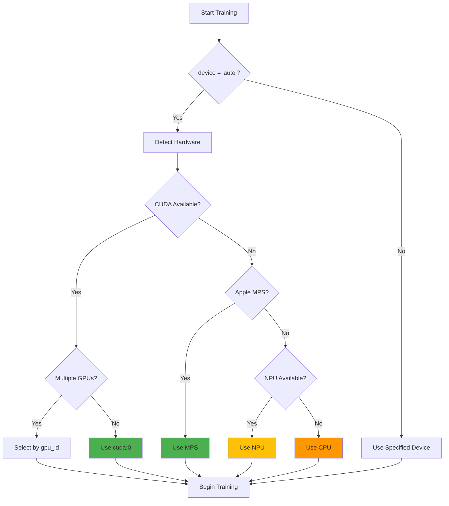

# GPU Training Configuration Guide

This guide covers GPU configuration for **NeuralMix** — a 250M parameter multimodal model designed to train on a single consumer GPU with 12GB VRAM.

**Primary target hardware:** NVIDIA RTX 3060 12GB (or AMD RX 6700 XT 12GB equivalent)

**VRAM budget:** Peak ~10–11GB with all memory optimizations active (BF16 AMP + Flash Attention 2 + gradient checkpointing). Without these optimizations, the model exceeds 11.5GB and will OOM on the RTX 3060. See [Implementation Status](#implementation-status) below.

> **Note:** BF16 AMP and Flash Attention 2 are configured in `configs/default.yaml` but not yet applied in the training loop (Epic 1 work in progress). Until Epic 1 is complete, full-precision training is the default and will exceed the 12GB VRAM target on the RTX 3060.

## Device Selection Flow



## Automatic GPU Detection

The project now includes automatic GPU detection and configuration. The system will:

1. **Automatically detect** available GPUs
2. **Select the best device** (GPU if available, otherwise CPU)
3. **Configure optimal settings** based on your hardware

## Implementation Status

| Memory Optimization | Config Location | Training Loop Status |
|--------------------|-----------------|---------------------|
| BF16 AMP (`autocast` + `GradScaler`) | `training.mixed_precision: bf16` | ⚠️ Configured, not yet applied in `train_epoch()` |
| Gradient checkpointing | `training.gradient_checkpointing: true` | ⚠️ Flag exists, `torch.utils.checkpoint` not applied |
| Flash Attention 2 | Planned replacement of `q @ k.T` | ❌ Not yet implemented |
| Gradient accumulation | `training.gradient_accumulation: 8` | ⚠️ Config flag present, not yet applied; optimizer steps every batch in `Trainer.train_epoch()` (effective batch size = `data.batch_size`) |
| Micro-batch size | `training.micro_batch_size: 4` | ⚠️ Config flag present, not yet applied; `training.micro_batch_size` currently ignored (effective batch size = `data.batch_size`) |

All items marked ⚠️ or ❌ are Epic 1 blockers. Do not attempt a full training run on an RTX 3060 12GB until Epic 1 is complete.

## Quick Start

### In `configs/default.yaml`:

```yaml
hardware:
  device: "auto"  # Automatically detects and uses GPU if available
  gpu_id: null    # null = auto-select, or specify 0, 1, 2, etc.
```

### In Jupyter Notebooks:

Run the GPU detection cell in `notebooks/01_getting_started.ipynb` to see your hardware capabilities.

## External GPU Support (eGPU)

The system automatically detects external GPUs connected via:
- **Thunderbolt 3/4**: Most common for eGPU enclosures
- **USB-C**: Some eGPU docks and enclosures  
- **External PCIe**: Desktop expansion chassis

### Supported eGPU Enclosures

**Thunderbolt eGPU:**
- Razer Core X/Core X Chroma
- Sonnet eGFX Breakaway Box
- Akitio Node/Node Pro

### eGPU Detection

```python
from src.utils.gpu_utils import detect_gpu_info, print_gpu_info

info = detect_gpu_info()
print_gpu_info(info)

# Check for external GPUs
if info['external_gpu_count'] > 0:
    print(f"Found {info['external_gpu_count']} external GPU(s)")
```

### eGPU Performance Notes

- Expect 10-25% performance reduction vs internal GPU
- Thunderbolt 3/4: 40 Gbps bandwidth
- Best for larger models where compute > memory bandwidth

## Configuration Options

### Device Settings

Set the `device` parameter in your config file:

- **`"auto"`** - Automatically detect and use GPU if available (recommended)
- **`"cpu"`** - Force CPU training
- **`"cuda"`** - Use default GPU
- **`"cuda:0"`** - Use specific GPU (for multi-GPU systems)
- **`"cuda:1"`** - Use second GPU

### Example Configurations

#### Single GPU System (Automatic)
```yaml
hardware:
  device: "auto"
  gpu_id: null
```

#### Multi-GPU System (Specify GPU)
```yaml
hardware:
  device: "cuda:0"  # Use first GPU
  gpu_id: 0         # Alternative way to specify
```

#### CPU-Only Training
```yaml
hardware:
  device: "cpu"
```

## GPU Detection Script

Use the built-in GPU detection utility:

```python
from src.utils.gpu_utils import detect_gpu_info, print_gpu_info

# Get GPU information
gpu_info = detect_gpu_info()
print_gpu_info(gpu_info)
```

This will display:
- Available GPUs and their names
- CUDA version
- Memory information
- Compute capability
- Mixed precision support

## Mixed Precision Training

The project supports multiple precision modes for faster training:

### FP16 (Half Precision)
- Supported on most NVIDIA GPUs
- ~2x faster training, ~2x less memory

```yaml
training:
  mixed_precision: "fp16"
```

### BF16 (BFloat16) - Recommended for Ampere GPUs
- Requires compute capability ≥ 8.0 (RTX 30xx, A100, etc.)
- Better numerical stability than FP16

```yaml
training:
  mixed_precision: "bf16"
```

### FP32 (Full Precision)
- Default, no special hardware requirements
- Slower but most compatible

```yaml
training:
  mixed_precision: null
```

## Installing CUDA Support

If you see "CUDA not available", you need to install PyTorch with CUDA:

### Step 1: Install CUDA Toolkit
Download and install from: https://developer.nvidia.com/cuda-downloads

Recommended version: CUDA 12.1

### Step 2: Install PyTorch with CUDA
```bash
# Uninstall CPU-only version
pip uninstall torch torchvision

# Install with CUDA 12.1 support
pip install torch torchvision --index-url https://download.pytorch.org/whl/cu121

# For CUDA 11.8
pip install torch torchvision --index-url https://download.pytorch.org/whl/cu118
```

### Step 3: Verify Installation
```python
import torch
print(f"CUDA available: {torch.cuda.is_available()}")
print(f"CUDA version: {torch.version.cuda}")
print(f"GPU: {torch.cuda.get_device_name(0)}")
```

## Multi-GPU Training

For systems with multiple GPUs, enable Distributed Data Parallel (DDP):

```yaml
hardware:
  device: "cuda"  # Will use all available GPUs
  ddp: true       # Enable distributed training
```

Or specify individual GPUs:
```yaml
hardware:
  device: "cuda:0"  # Use specific GPU
  ddp: false
```

## Troubleshooting

### "CUDA out of memory"
1. Reduce batch size:
   ```yaml
   data:
     batch_size: 16  # Try smaller values
   ```

2. Enable gradient accumulation:
   ```yaml
   training:
     micro_batch_size: 4
     gradient_accumulation: 8  # Effective batch = 4 * 8 = 32
   ```

3. Enable gradient checkpointing:
   ```yaml
   training:
     gradient_checkpointing: true
   ```

### "CUDA driver version is insufficient"
Update your NVIDIA drivers: https://www.nvidia.com/Download/index.aspx

### "RuntimeError: CUDA error: no kernel image is available"
Your GPU's compute capability is not supported. Install PyTorch for your specific GPU architecture.

## GPU Information API

The `gpu_utils.py` module provides several helpful functions:

```python
from src.utils.gpu_utils import (
    detect_gpu_info,           # Get detailed GPU information
    print_gpu_info,            # Print formatted GPU details
    get_optimal_device,        # Get best device string
    configure_device_for_training,  # Configure torch device
    check_mixed_precision_support   # Check FP16/BF16 support
)

# Example: Get optimal device
device = get_optimal_device(prefer_gpu=True)
print(f"Using device: {device}")

# Example: Check what precision modes are supported
support = check_mixed_precision_support()
if support['bf16']:
    print("BF16 training recommended!")
elif support['fp16']:
    print("FP16 training available")
```

## Performance Tips

1. **Use mixed precision** if your GPU supports it (huge speedup)
2. **Maximize batch size** until you run out of memory
3. **Use gradient accumulation** to simulate larger batches
4. **Enable pin_memory** for faster data loading:
   ```yaml
   data:
     pin_memory: true
   ```
5. **Increase num_workers** for data loading (but not too high):
   ```yaml
   data:
     num_workers: 4  # Start here, adjust based on CPU cores
   ```

## Recommended Configurations by GPU

### NVIDIA RTX 3060 12GB (Primary Target)

This is the minimum target hardware for NeuralMix. Requires all Epic 1 memory optimizations to be active.

```yaml
hardware:
  device: "auto"
  max_memory: "11GB"
training:
  mixed_precision: "bf16"
  gradient_checkpointing: true
  micro_batch_size: 4
  gradient_accumulation: 8
data:
  pin_memory: true
  num_workers: 4
```

### NVIDIA RTX 3070 / 4060 Ti 16GB

```yaml
hardware:
  device: "auto"
training:
  mixed_precision: "bf16"
  gradient_checkpointing: true
  micro_batch_size: 6
  gradient_accumulation: 6
data:
  pin_memory: true
  num_workers: 4
```

### NVIDIA RTX 3090 / 4090 (24GB)

```yaml
hardware:
  device: "auto"
training:
  mixed_precision: "bf16"
  micro_batch_size: 16
  gradient_accumulation: 2
data:
  batch_size: 32
```

### NVIDIA RTX 3080 / 4080 (10-16GB)

```yaml
hardware:
  device: "auto"
training:
  mixed_precision: "bf16"
  gradient_checkpointing: true
data:
  batch_size: 16
```

### NVIDIA GTX 1080 Ti (11GB)

```yaml
hardware:
  device: "auto"
training:
  mixed_precision: "fp16"
  gradient_checkpointing: true
data:
  batch_size: 8
```

### CPU Only

```yaml
hardware:
  device: "cpu"
training:
  mixed_precision: null
data:
  batch_size: 4
  num_workers: 4
```

## Additional Resources

- [PyTorch CUDA Installation Guide](https://pytorch.org/get-started/locally/)
- [NVIDIA CUDA Downloads](https://developer.nvidia.com/cuda-downloads)
- [Mixed Precision Training](https://pytorch.org/docs/stable/amp.html)
- [Multi-GPU Training with DDP](https://pytorch.org/tutorials/intermediate/ddp_tutorial.html)
