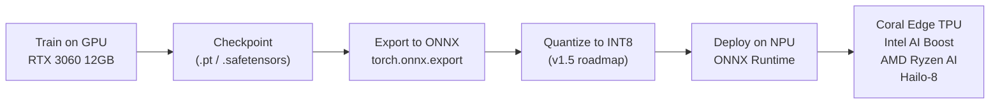

# NPU Inference Guide

This guide covers how to use Neural Processing Units (NPUs) with **NeuralMix** for inference and edge deployment.

**NPUs are for inference, not training.** NeuralMix v1 trains on GPU (RTX 3060 12GB target). After training, export the model to ONNX and run inference on NPUs via ONNX Runtime.

**v2 roadmap:** NeuralMix v2 targets ARM Cortex-M, NVIDIA Jetson, and Raspberry Pi 5 class hardware with 10M/50M/100M parameter tiers and full online adaptation at the device level. See [docs/ROADMAP.md](ROADMAP.md) for the edge IoT roadmap.

## NeuralMix + NPU Workflow



**v1 status:** ONNX export is supported via `torch.onnx.export`. INT8 quantization is planned for v1.5. The `inference.py` entry point loads a checkpoint and runs a forward pass; production NPU serving is a v1.5+ feature.

## Table of Contents
- [What is an NPU?](#what-is-an-npu)
- [Supported NPU Types](#supported-npu-types)
- [External NPU Support](#external-npu-support)
- [NPU Detection](#npu-detection)
- [Configuration](#configuration)
- [Platform-Specific Setup](#platform-specific-setup)
- [Limitations and Considerations](#limitations-and-considerations)
- [Performance Comparison](#performance-comparison)
- [Troubleshooting](#troubleshooting)

## What is an NPU?

A Neural Processing Unit (NPU) is a specialized accelerator designed specifically for AI workloads. NPUs offer:
- **Power Efficiency**: Lower power consumption than GPUs
- **Optimized for Inference**: Excellent for deployment scenarios
- **Integrated Design**: Built into modern CPUs (Intel, AMD, Apple, Qualcomm)
- **Low Latency**: Fast inference for edge computing

## Supported NPU Types

### Intel AI Boost (VPU)
- **Processors**: Meteor Lake (Core Ultra), Lunar Lake
- **Backend**: OpenVINO
- **Capabilities**: INT8/FP16 inference, ~10 TOPS
- **Best For**: Windows laptops, edge devices

### AMD Ryzen AI
- **Processors**: Ryzen 7040/8040 series (Phoenix, Hawk Point)
- **Backend**: Ryzen AI SDK, DirectML
- **Capabilities**: INT8/FP16 inference, ~10-16 TOPS
- **Best For**: Windows laptops, productivity workloads

### Apple Neural Engine
- **Processors**: M1, M2, M3 series
- **Backend**: Core ML
- **Capabilities**: INT8/FP16 inference, up to 15.8 TOPS (M1)
- **Best For**: macOS development, iOS deployment

### Qualcomm Hexagon NPU
- **Processors**: Snapdragon X Elite/Plus (Windows on ARM)
- **Backend**: DirectML, SNPE
- **Capabilities**: INT8 inference, ~45 TOPS
- **Best For**: Windows on ARM devices

## External NPU Support

The system supports external NPU accelerators connected via USB or PCIe:

### Supported External NPUs

**USB NPUs:**
- **Intel Neural Compute Stick 2 (NCS2)**
  - USB 3.0 connection
  - OpenVINO backend
  - ~1 TOPS, INT8 inference
  - Price: ~$70-100

- **Google Coral Edge TPU (USB Accelerator)**
  - USB 3.0/3.1 connection
  - TensorFlow Lite backend
  - 4 TOPS, INT8 inference only
  - Price: ~$60-75

- **Intel Movidius VPU**
  - USB connection
  - OpenVINO backend
  - Legacy support for Myriad X

**PCIe/M.2 NPUs:**
- **Hailo-8 AI Accelerator**
  - PCIe/M.2 card
  - 26 TOPS INT8 inference
  - Hailo Runtime backend
  - Price: ~$200-300

- **Google Coral M.2/PCIe Accelerator**
  - M.2 A+E or PCIe form factors
  - TensorFlow Lite backend
  - 4 TOPS INT8
  - Price: ~$25-60

### External NPU Detection

```python
from src.utils.npu_utils import detect_npu_info, print_npu_info

npu_info = detect_npu_info()
print_npu_info(npu_info)

# Check if external NPU
if npu_info['available'] and npu_info.get('is_external', False):
    print(f"External NPU detected: {npu_info['device_name']}")
    print(f"Connection: {npu_info['connection_type']}")
    print(f"Backend: {npu_info['backend']}")
```

### External NPU Setup

**Intel Neural Compute Stick 2:**
```bash
# Install OpenVINO
pip install openvino openvino-dev

# Verify device
python -c "from openvino.runtime import Core; core = Core(); print(core.available_devices())"
# Should show: ['CPU', 'MYRIAD']
```

**Google Coral Edge TPU:**
```bash
# Install TensorFlow Lite runtime
pip install tflite-runtime

# Install Edge TPU runtime
# Linux:
echo "deb https://packages.cloud.google.com/apt coral-edgetpu-stable main" | sudo tee /etc/apt/sources.list.d/coral-edgetpu.list
curl https://packages.cloud.google.com/apt/doc/apt-key.gpg | sudo apt-key add -
sudo apt-get update
sudo apt-get install libedgetpu1-std

# Windows/macOS:
# Download from https://coral.ai/software/
```

**Hailo-8:**
```bash
# Install Hailo Runtime
# Download from https://hailo.ai/developer-zone/
pip install hailort

# Verify device
hailortcli fw-control identify
```

### External NPU Performance

**Comparison (ResNet-50 Inference, Batch=1):**

| Device | TOPS | Power | Throughput | Interface |
|--------|------|-------|------------|----------|
| Intel NCS2 | 1 | 2.5W | ~15 fps | USB 3.0 |
| Coral USB | 4 | 2W | ~100 fps | USB 3.0 |
| Coral M.2 | 4 | 2W | ~100 fps | PCIe/M.2 |
| Hailo-8 | 26 | 2.5W | ~600 fps | PCIe |
| Intel AI Boost (internal) | 10 | 8W | ~45 fps | Integrated |

### Use Cases for External NPUs

**When to use external NPU:**
- ✅ Desktop without internal NPU/GPU
- ✅ Prototyping edge deployment
- ✅ Multi-device inference (USB hub with multiple Coral TPUs)
- ✅ Power-efficient inference on older hardware
- ✅ Development/testing for edge devices

**When NOT to use external NPU:**
- ❌ Training (NPUs are inference-only)
- ❌ When internal GPU is available (GPU typically faster)
- ❌ Real-time with high resolution (USB bandwidth limits)
- ❌ Models > 256MB (Coral TPU has 8GB/s USB bandwidth)

### Multi-NPU Configuration

You can use multiple external NPUs simultaneously:

```python
# Example: Multiple Coral Edge TPUs
import tflite_runtime.interpreter as tflite

# List available TPUs
devices = ['usb:0', 'usb:1', 'usb:2']  # Multiple Coral devices

interpreters = []
for device in devices:
    try:
        interpreter = tflite.Interpreter(
            model_path='model.tflite',
            experimental_delegates=[
                tflite.load_delegate('libedgetpu.so.1', {'device': device})
            ]
        )
        interpreter.allocate_tensors()
        interpreters.append(interpreter)
        print(f"Loaded model on {device}")
    except Exception as e:
        print(f"Failed to load on {device}: {e}")

print(f"Total NPUs available: {len(interpreters)}")
```

## NPU Detection

The project automatically detects available NPUs (both internal and external). Check detection:

```python
from src.utils.npu_utils import detect_npu_info, print_npu_info

npu_info = detect_npu_info()
print_npu_info(npu_info)
```

Example output:
```
NPU Information:
  Available: Yes
  Device Name: Intel AI Boost (VPU)
  NPU Type: intel
  Backend: openvino
  Compute Units: 4
  Memory: Shared system memory
```

## Configuration

### Basic Configuration

Edit `configs/default.yaml`:

```yaml
hardware:
  device: "npu"              # Use NPU directly
  # OR
  device: "auto"             # Auto-detect
  prefer_npu: true           # Prefer NPU over GPU
```

### Device Options

- `"npu"`: Force NPU usage (falls back to CPU if unavailable)
- `"auto"`: Auto-select best device (respects prefer_npu)
- `"openvino"`: Intel AI Boost via OpenVINO
- `"ryzenai"`: AMD Ryzen AI
- `"mps"`: Apple Neural Engine
- `"cpu"`: CPU fallback

### Training vs Inference

**Important**: PyTorch NPU support is limited. Current workflow:

1. **Training**: Use GPU or CPU
   ```yaml
   hardware:
     device: "cuda"  # or "cpu"
   ```

2. **Export**: Convert to ONNX
   ```python
   import torch.onnx
   torch.onnx.export(model, dummy_input, "model.onnx")
   ```

3. **NPU Inference**: Use ONNX Runtime with NPU execution provider
   ```python
   import onnxruntime as ort
   # Intel
   sess = ort.InferenceSession("model.onnx", 
                                providers=['OpenVINOExecutionProvider'])
   # AMD
   sess = ort.InferenceSession("model.onnx",
                                providers=['DmlExecutionProvider'])
   ```

## Platform-Specific Setup

### Intel AI Boost (Windows/Linux)

1. **Install OpenVINO**:
   ```bash
   pip install openvino openvino-dev
   ```

2. **Verify Installation**:
   ```python
   from openvino.runtime import Core
   core = Core()
   print(core.available_devices)  # Should show 'NPU'
   ```

3. **Configure**:
   ```yaml
   hardware:
     device: "openvino"
   ```

### AMD Ryzen AI (Windows)

1. **Install Ryzen AI SDK**:
   - Download from AMD Developer Portal
   - Requires Windows 11 with latest drivers

2. **Install DirectML**:
   ```bash
   pip install torch-directml
   ```

3. **Verify**:
   ```python
   import torch_directml
   print(torch_directml.device_count())
   ```

4. **Configure**:
   ```yaml
   hardware:
     device: "ryzenai"
   ```

### Apple Neural Engine (macOS)

1. **Ensure PyTorch with MPS**:
   ```bash
   # Should be included in standard PyTorch installation
   python -c "import torch; print(torch.backends.mps.is_available())"
   ```

2. **Configure**:
   ```yaml
   hardware:
     device: "mps"
   ```

3. **For Core ML**:
   ```bash
   pip install coremltools
   # Export to Core ML format
   import coremltools as ct
   mlmodel = ct.convert(model)
   ```

### Qualcomm Hexagon (Windows on ARM)

1. **Install DirectML**:
   ```bash
   pip install torch-directml
   ```

2. **Configure**:
   ```yaml
   hardware:
     device: "privateuseone"  # Qualcomm NPU
   ```

## Limitations and Considerations

### Current PyTorch NPU Support

- **Limited Training**: Most NPUs don't support training operations
- **Inference Focus**: Optimized for model deployment
- **Precision**: Primarily INT8/FP16 (no FP32 typically)
- **ONNX Recommended**: Better NPU support via ONNX Runtime

### Memory Constraints

- NPUs typically use **shared system memory**
- Memory bandwidth lower than dedicated GPUs
- Optimize batch sizes accordingly

### Operator Support

Not all PyTorch operators supported on NPUs:
- Check backend documentation for supported ops
- Consider operator fusion and quantization
- Test thoroughly before deployment

### Performance Expectations

NPUs excel at:
- ✅ Inference (especially INT8)
- ✅ Power-efficient computing
- ✅ Edge deployment
- ✅ Batch size 1-8

GPUs excel at:
- ✅ Training
- ✅ Large batch inference
- ✅ FP32/FP16 precision
- ✅ Custom operations

## Performance Comparison

### Inference Benchmark (ResNet-50, Batch Size 1)

| Device | Throughput (img/s) | Power (W) | Efficiency (img/s/W) |
|--------|-------------------|-----------|---------------------|
| NVIDIA RTX 4090 | 2500 | 450 | 5.6 |
| NVIDIA RTX 4070 | 1200 | 200 | 6.0 |
| Intel AI Boost | 45 | 8 | 5.6 |
| AMD Ryzen AI | 50 | 10 | 5.0 |
| Apple M3 Neural Engine | 80 | 12 | 6.7 |
| CPU (13th Gen i9) | 35 | 125 | 0.28 |

*Note: Benchmarks approximate, INT8 quantization used for NPUs*

### When to Use Each Device

**Use GPU when:**
- Training models
- Large batch inference (>32)
- FP32 precision required
- Maximum throughput needed
- Custom CUDA operations

**Use NPU when:**
- Power efficiency critical
- Edge/mobile deployment
- Batch size 1-8
- INT8 quantization acceptable
- Integrated hardware preferred

**Use CPU when:**
- No accelerator available
- Debugging/development
- Small models
- Irregular workloads

## Troubleshooting

### NPU Not Detected

1. **Check Processor**:
   ```bash
   # Windows
   systeminfo | findstr /C:"Processor"
   # Linux
   lscpu | grep "Model name"
   # macOS
   sysctl -n machdep.cpu.brand_string
   ```

2. **Update Drivers**:
   - Intel: Install latest Graphics/NPU drivers
   - AMD: Update AMD Software (Adrenalin)
   - Apple: Update macOS to latest version

3. **Verify Backend**:
   ```python
   # Intel
   from openvino.runtime import Core
   core = Core()
   print("NPU" in core.available_devices)
   
   # AMD
   import torch_directml
   print(torch_directml.device_count() > 0)
   
   # Apple
   import torch
   print(torch.backends.mps.is_available())
   ```

### Poor Performance

1. **Use INT8 Quantization**:
   ```python
   from torch.quantization import quantize_dynamic
   quantized_model = quantize_dynamic(model, {torch.nn.Linear}, dtype=torch.qint8)
   ```

2. **Optimize Batch Size**:
   - NPUs optimal at batch size 1-8
   - GPU better for larger batches

3. **Profile Operations**:
   ```python
   # Use ONNX Runtime profiling
   import onnxruntime as ort
   sess_options = ort.SessionOptions()
   sess_options.enable_profiling = True
   ```

### ONNX Export Issues

1. **Unsupported Operations**:
   ```python
   # Check which ops are problematic
   # opset_version=18 is the default for PyTorch 2.8+
   torch.onnx.export(model, dummy_input, "model.onnx", 
                     verbose=True, opset_version=18)
   ```

2. **Dynamic Shapes**:
   ```python
   # Specify dynamic axes
   dynamic_axes = {'input': {0: 'batch'}, 'output': {0: 'batch'}}
   torch.onnx.export(model, dummy_input, "model.onnx",
                     dynamic_axes=dynamic_axes)
   ```

### Memory Issues

1. **Reduce Batch Size**:
   ```yaml
   training:
     batch_size: 4  # Lower for NPU
   ```

2. **Use Gradient Checkpointing** (if training supported):
   ```python
   model.gradient_checkpointing_enable()
   ```

## Recommended Workflow

### Development Phase
1. Train on GPU/CPU with FP32
2. Validate accuracy and convergence
3. Profile model for NPU compatibility

### Optimization Phase
1. Quantize to INT8/FP16
2. Export to ONNX
3. Validate accuracy on CPU/GPU with ONNX

### Deployment Phase
1. Test on target NPU via ONNX Runtime
2. Benchmark performance
3. Deploy to production

## Additional Resources

- [OpenVINO Documentation](https://docs.openvino.ai/)
- [AMD Ryzen AI](https://www.amd.com/en/products/ryzen-ai)
- [Apple Core ML](https://developer.apple.com/documentation/coreml)
- [ONNX Runtime](https://onnxruntime.ai/)
- [Qualcomm SNPE](https://developer.qualcomm.com/software/qualcomm-neural-processing-sdk)

## Example: Full NPU Inference Pipeline

```python
import torch
import onnxruntime as ort
from src.models import create_model
from src.utils.config import load_config

# 1. Load trained model
config = load_config("configs/default.yaml")
model = create_model(config)
   # Prefer loading safetensors model weights when available
   from src.utils.safe_load import safe_load_checkpoint
   checkpoint = safe_load_checkpoint("checkpoints/best_model.safetensors", map_location="cpu", expected_keys={"model_state_dict"})
   model.load_state_dict(checkpoint['model_state_dict'])
model.eval()

# 2. Export to ONNX
dummy_input = torch.randn(1, 3, 224, 224)
torch.onnx.export(
    model, 
    dummy_input, 
    "model.onnx",
    input_names=['input'],
    output_names=['output'],
    dynamic_axes={'input': {0: 'batch'}, 'output': {0: 'batch'}}
)

# 3. Load with NPU backend
# Intel
session = ort.InferenceSession(
    "model.onnx",
    providers=['OpenVINOExecutionProvider', 'CPUExecutionProvider']
)

# AMD
session = ort.InferenceSession(
    "model.onnx",
    providers=['DmlExecutionProvider', 'CPUExecutionProvider']
)

# 4. Run inference
input_data = dummy_input.numpy()
outputs = session.run(None, {'input': input_data})
print(f"Output shape: {outputs[0].shape}")
```

## NeuralMix v2 Edge Targets

NeuralMix v2 (roadmap) is designed for the deployment environment that inspired the project: edge IoT devices where you cannot retrain in the cloud every time hardware capabilities shift.

| Target Platform | Parameter Tier | Connection | Use Case |
|----------------|---------------|------------|----------|
| NVIDIA Jetson Nano | 100M | Onboard | Edge inference with online adaptation |
| Raspberry Pi 5 | 50M | USB / PCIe | Low-power IoT sensor fusion |
| Google Coral Edge TPU | 10M | USB / M.2 | Ultra-low-power inference |
| ARM Cortex-M class | 10M | Integrated | Microcontroller deployment |

v2 implements the full double-loop online adaptation loop: the meta-controller runs on-device to adapt to distribution shift (sensor drift, environmental changes) without cloud retraining. This is the architectural promise that motivated NeuralMix from day one.

See [docs/ROADMAP.md](ROADMAP.md) for v2 advancement criteria.

## Summary

NPUs provide power-efficient inference for AI models. NeuralMix v1 trains on GPU and exports to ONNX for NPU inference. v1.5 adds INT8 quantization and a validated ONNX export pipeline. v2 targets edge IoT hardware natively with 10M–100M parameter tiers and on-device meta-learning adaptation.
