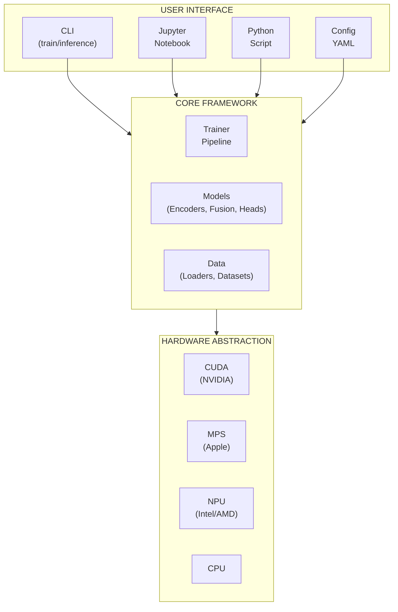
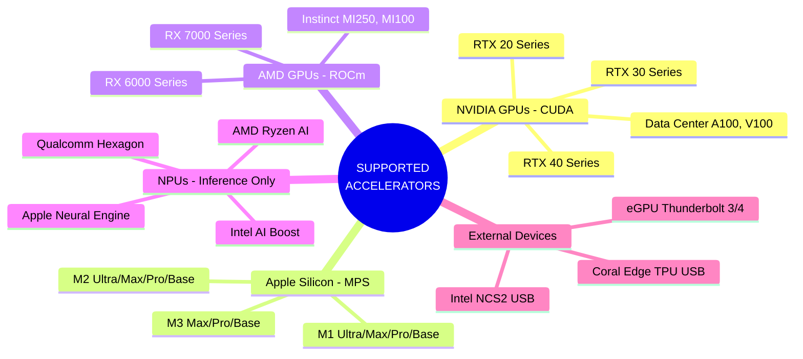
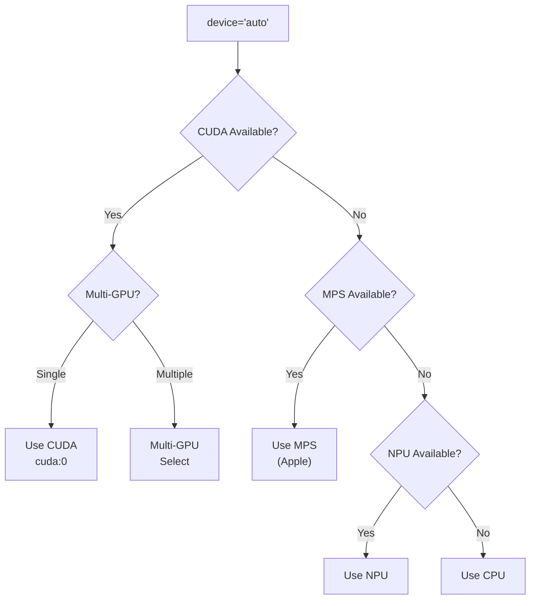
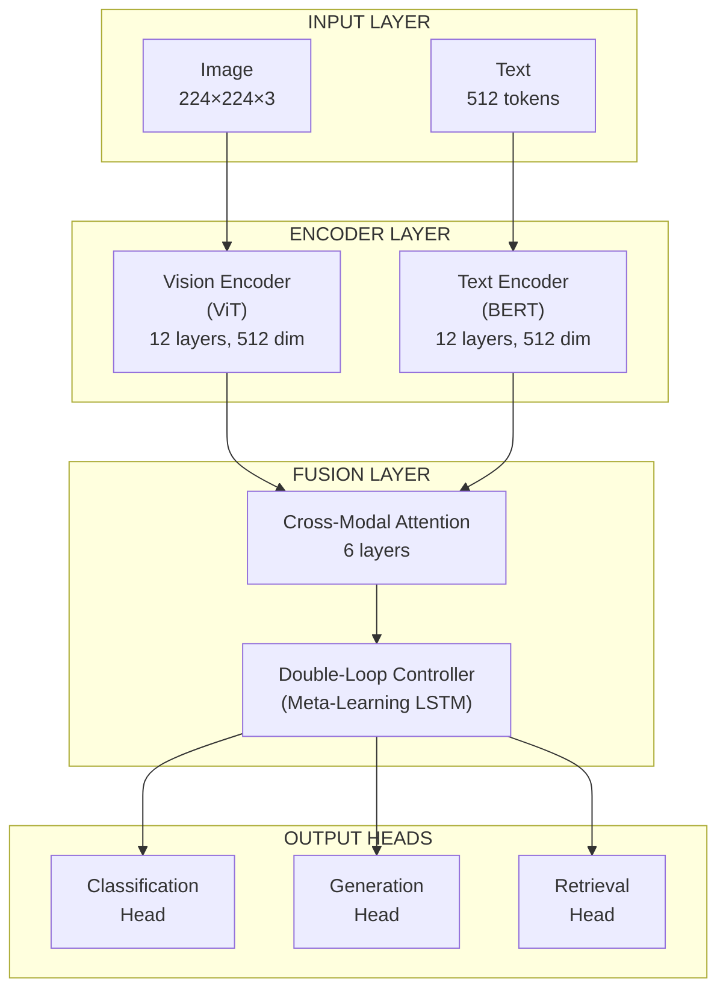
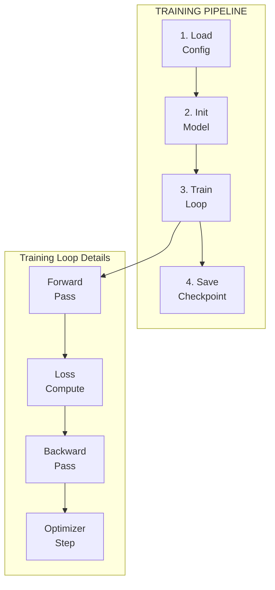
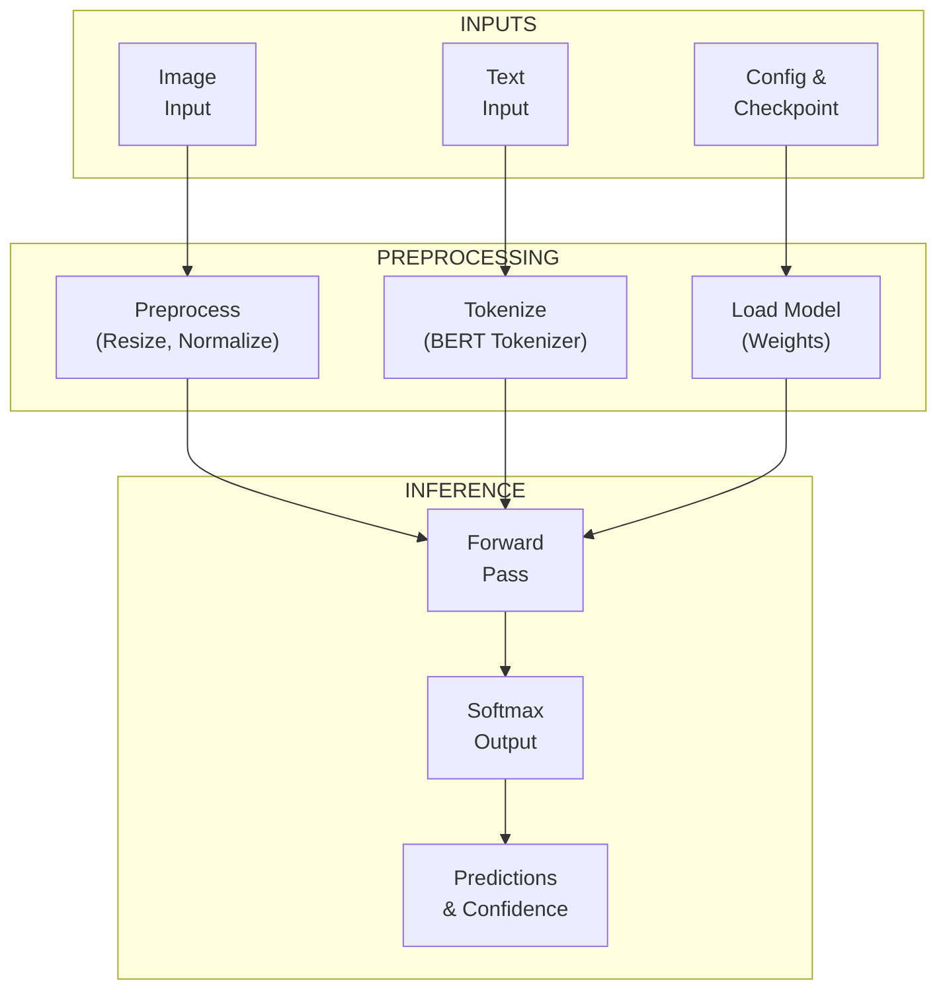
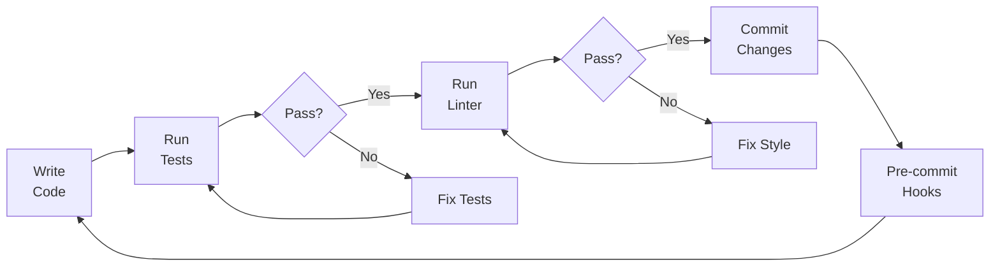
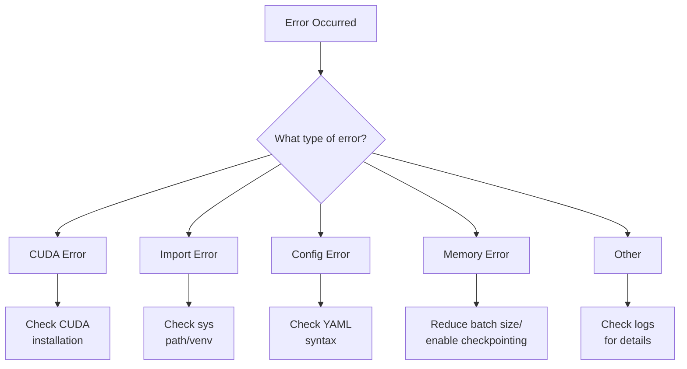

# Multi-Modal Neural Network - User Guide

[](https://opensource.org/licenses/Apache-2.0)
[](https://www.python.org/downloads/)

> **A comprehensive step-by-step guide for installing, configuring, training, and deploying the Multi-Modal Neural Network with Double-Loop Learning.**

---

## 📑 Table of Contents

1. [Introduction](#introduction)
2. [System Requirements](#system-requirements)
3. [Installation Guide](#installation-guide)
4. [Project Structure Overview](#project-structure-overview)
5. [Configuration Guide](#configuration-guide)
6. [Hardware Detection & Setup](#hardware-detection--setup)
7. [Training Workflow](#training-workflow)
8. [Inference Guide](#inference-guide)
9. [Development Tools](#development-tools)
10. [Troubleshooting](#troubleshooting)
11. [Quick Reference](#quick-reference)

---

## Introduction

### What is this Project?

The Multi-Modal Neural Network is an open-source implementation that combines:
- **Vision Processing**: Image understanding using Vision Transformer (ViT)
- **Text Processing**: Natural language understanding using BERT-style encoders
- **Double-Loop Learning**: Meta-learning for structural adaptation during training
- **External Knowledge**: Integration with Wolfram Alpha for computational enhancement

### System Architecture Overview



---

## System Requirements

### Minimum Requirements

| Component | Specification |
|-----------|--------------|
| **Python** | 3.10 or higher |
| **RAM** | 16 GB |
| **Storage** | 50 GB free space |
| **OS** | Windows 10/11, macOS 12+, Linux |

### Recommended for GPU Training

| Component | Specification |
|-----------|--------------|
| **GPU** | NVIDIA RTX 3060 12GB or better |
| **CUDA** | 12.1+ |
| **RAM** | 32 GB |
| **CPU** | 8-core / 16-thread |

### Supported Hardware



---

## Installation Guide

### Step 1: Clone the Repository

```powershell
# Clone the repository
git clone https://github.com/tim-dickey/multi-modal-neural-network.git

# Navigate to project directory
cd multi-modal-neural-network
```

**Expected Output:**
```
Cloning into 'multi-modal-neural-network'...
remote: Enumerating objects: 500, done.
remote: Counting objects: 100% (500/500), done.
Receiving objects: 100% (500/500), 2.50 MiB | 5.00 MiB/s, done.
Resolving deltas: 100% (300/300), done.
```

### Step 2: Create Virtual Environment

```powershell
# Create virtual environment
python -m venv .venv

# Activate virtual environment (Windows PowerShell)
.\.venv\Scripts\Activate.ps1

# Activate virtual environment (Windows Command Prompt)
.\.venv\Scripts\activate.bat

# Activate virtual environment (Linux/macOS)
source .venv/bin/activate
```

**Verification (Terminal shows environment name):**
```
(.venv) PS C:\path\to\multi-modal-neural-network>
```

### Step 3: Install Dependencies

```powershell
# Install production dependencies
pip install -r requirements.txt
```

**Progress Display:**

> **Note:** Version numbers in this example are illustrative and may differ from actual releases. Your installation will show the latest available versions.

```
Collecting torch>=2.0.0
  Downloading torch-2.5.1-cp311-cp311-win_amd64.whl (210.5 MB)
     ━━━━━━━━━━━━━━━━━━━━━━━━━━━━━━━━━━━━ 210.5/210.5 MB 10.5 MB/s
...
Successfully installed torch-2.5.1 transformers-4.44.0 ...
```

> **Note:** Version numbers shown in examples are illustrative. Actual versions installed may differ based on your requirements.txt and available releases.

### Step 4: Install GPU Support (Optional)

```powershell
# For NVIDIA GPU with CUDA 12.1
pip uninstall torch torchvision
pip install torch torchvision --index-url https://download.pytorch.org/whl/cu121

# For NVIDIA GPU with CUDA 11.8
pip install torch torchvision --index-url https://download.pytorch.org/whl/cu118
```

### Step 5: Verify Installation

```powershell
# Run verification
python -c "import torch; print(f'PyTorch: {torch.__version__}'); print(f'CUDA: {torch.cuda.is_available()}')"
```

**Expected Output (with GPU):**

> **Note:** Version numbers shown are illustrative. Your actual output will reflect the installed version.

```
PyTorch: 2.3.0+cu121
CUDA: True
```

### Installation Workflow Diagram


---

## Project Structure Overview

```
multi-modal-neural-network/
│
├── 📁 configs/                    # Configuration files
│   └── default.yaml              # Main configuration
│
├── 📁 src/                        # Source code
│   ├── 📁 models/                # Neural network components
│   │   ├── multi_modal_model.py  # Main model class
│   │   ├── vision_encoder.py     # Vision Transformer
│   │   ├── text_encoder.py       # BERT-style encoder
│   │   ├── fusion_layer.py       # Multi-modal fusion
│   │   ├── double_loop_controller.py  # Meta-learning
│   │   └── heads.py              # Task-specific heads
│   │
│   ├── 📁 training/              # Training infrastructure
│   │   ├── trainer.py            # Main trainer class
│   │   ├── optimizer.py          # Optimizer utilities
│   │   ├── losses.py             # Loss functions
│   │   └── checkpoint_manager.py # Checkpoint handling
│   │
│   ├── 📁 data/                  # Data processing
│   │   ├── dataset.py            # Dataset classes
│   │   └── selector.py           # Multi-dataset selector
│   │
│   ├── 📁 utils/                 # Utilities
│   │   ├── config.py             # Configuration loader
│   │   ├── gpu_utils.py          # GPU detection
│   │   ├── npu_utils.py          # NPU detection
│   │   └── logging.py            # Logging utilities
│   │
│   └── 📁 integrations/          # External APIs
│       └── wolfram_alpha.py      # Wolfram Alpha client
│
├── 📁 notebooks/                  # Jupyter notebooks
│   ├── 01_getting_started.ipynb  # Setup guide
│   ├── 02_training.ipynb         # Training tutorial
│   └── 03_evaluation.ipynb       # Evaluation tutorial
│
├── 📁 tests/                      # Test suite
├── 📁 docs/                       # Documentation
│
├── train.py                       # Training entry point
├── inference.py                   # Inference entry point
├── requirements.txt               # Dependencies
└── Makefile                       # Build commands
```

---

## Configuration Guide

### Configuration File Location

The main configuration file is located at `configs/default.yaml`.

### Key Configuration Sections

#### 1. Hardware Configuration

```yaml
# configs/default.yaml

hardware:
  device: "auto"      # Options: "auto", "cuda", "cpu", "mps", "npu"
  gpu_id: null        # Specific GPU index (0, 1, 2, etc.)
  prefer_npu: false   # Prefer NPU over GPU when both available
  max_memory: "11GB"  # Maximum GPU memory to use
  compile_model: true # Enable torch.compile optimization
```

**Device Selection Flowchart:**



#### 2. Model Configuration

```yaml
model:
  vision_encoder:
    type: "vit_small"      # Vision Transformer variant
    patch_size: 16         # Patch size for ViT
    hidden_dim: 512        # Hidden dimension
    num_layers: 12         # Number of transformer layers
    num_heads: 8           # Number of attention heads

  text_encoder:
    type: "bert_small"     # Text encoder variant
    hidden_dim: 512        # Hidden dimension
    num_layers: 12         # Number of transformer layers
    num_heads: 8           # Number of attention heads

  fusion:
    type: "early"          # Fusion type: "early" or "late"
    hidden_dim: 512
    num_layers: 6
    num_heads: 8

  heads:
    num_classes: 1000      # Number of output classes
    hidden_dim: 512
```

**Model Architecture Diagram:**



#### 3. Training Configuration

```yaml
training:
  micro_batch_size: 4         # Batch size per GPU
  gradient_accumulation: 8    # Accumulation steps
  max_epochs: 50              # Maximum training epochs
  inner_lr: 3e-4              # Learning rate
  warmup_steps: 1000          # Warmup steps
  mixed_precision: "bf16"     # Precision: "bf16", "fp16", null
  gradient_checkpointing: true # Memory optimization
  optimizer: "adamw"          # Optimizer type
  scheduler: "cosine"         # LR scheduler
  weight_decay: 0.01          # Weight decay
  max_grad_norm: 1.0          # Gradient clipping
```

#### 4. Data Configuration

```yaml
data:
  batch_size: 32              # Total batch size
  num_workers: 4              # Data loading workers
  pin_memory: true            # Pin memory for GPU
  
  # Multi-dataset configuration
  datasets:
    - name: multimodal_core
      type: multimodal
      data_dir: ./data/multimodal
      splits:
        train: 0.8
        val: 0.1
        test: 0.1
      enabled: true
      
    - name: captions_aux
      type: coco_captions
      root: ./data/coco/images
      ann_file: ./data/coco/annotations/captions_train2017.json
      enabled: true
```

### Creating a Custom Configuration

```powershell
# Copy default configuration
Copy-Item configs/default.yaml configs/my_config.yaml

# Edit with your preferred editor
code configs/my_config.yaml
```

---

## Hardware Detection & Setup

### Automatic Hardware Detection

The project automatically detects available hardware. Run the following to check your system:

```python
# In Python or Jupyter notebook
from src.utils.gpu_utils import detect_gpu_info, print_gpu_info
from src.utils.npu_utils import detect_npu_info, print_npu_info

# Check GPU
gpu_info = detect_gpu_info()
print_gpu_info(gpu_info)

# Check NPU
npu_info = detect_npu_info()
print_npu_info(npu_info)
```

### GPU Detection Output Example

```
================================================================================
GPU Information
================================================================================
  CUDA Available: Yes
  CUDA Version: 12.1
  cuDNN Version: 8.9.7
  Device Count: 1

  Device 0: NVIDIA GeForce RTX 4070
    Compute Capability: 8.9
    Total Memory: 12.00 GB
    Memory Allocated: 0.00 GB
    Memory Cached: 0.00 GB

Mixed Precision Support:
  FP16: ✓ Supported
  BF16: ✓ Supported
  TF32: ✓ Supported
================================================================================
```

### NPU Detection Output Example

```
================================================================================
NPU Information
================================================================================
  Available: Yes
  Device Name: Intel AI Boost (VPU)
  NPU Type: intel
  Backend: openvino
  Is External: No
================================================================================
```

### Hardware Selection Matrix

| Use Case | Best Choice | Alternative | Fallback | Config |
|----------|-------------|-------------|----------|--------|
| Training (Large Model) | NVIDIA GPU (RTX 4090) | Apple MPS (M3 Max) | CPU | cuda/mps |
| Training (Small Model) | NVIDIA GPU (RTX 3060) | Apple MPS (M1) | CPU | cuda/mps |
| Inference (Edge Device) | NPU (Edge TPU) | GPU | CPU | npu/auto |
| Development (Testing) | auto | cpu | - | auto |

---

## Training Workflow

### Training Pipeline Overview



### Method 1: Command Line Training

```powershell
# Validate config/model/data wiring without starting training
python train.py --config configs/default.yaml --check

# Basic training with default config
python train.py --config configs/default.yaml

# Training with custom config
python train.py --config configs/my_config.yaml

# Resume from checkpoint
python train.py --config configs/default.yaml --resume checkpoints/latest.safetensors

# Force specific device
python train.py --config configs/default.yaml --device cuda
```

Use `--check` to validate configuration, model, and data setup without starting training—ideal for debugging setup issues before committing to a full run.

**Example `--check` Output:**
```
CHECK MODE: validating training prerequisites
config: configs/default.yaml
model: ok
data: ok
```

For real training runs, see logs in `output_dir/logs/`, checkpoints in `output_dir/checkpoints/`, and profiling artifacts in `output_dir/profiling/epoch_XXXX_profile.json`.

### Method 2: Python Script Training

```python
# train_model.py
from src.training import Trainer
from src.utils.config import load_config

# Load configuration
config = load_config("configs/default.yaml")

# Create trainer
trainer = Trainer(
    config_path="configs/default.yaml",
    device="cuda"  # or "auto", "cpu", "mps"
)

# Start training
trainer.train()
```

### Method 3: Jupyter Notebook Training

Open `notebooks/02_training.ipynb` for an interactive training experience.

```python
# Cell 1: Setup
import sys
sys.path.append('..')
from src.training import Trainer

# Cell 2: Configure
trainer = Trainer(config_path="../configs/default.yaml")

# Cell 3: Train
trainer.train()
```

### Training Checkpoints

Training artifacts are written under the configured output directory:

```
output_dir/
├── checkpoints/
│   ├── latest.safetensors       # Most recent checkpoint
│   ├── best.safetensors         # Best validation loss
│   ├── epoch_001.safetensors    # Epoch-specific checkpoints
│   └── ...
└── profiling/
    └── epoch_0001_profile.json  # Peak VRAM, average step time, command
```

### Monitoring Training Progress

**Console Output:**
```
Epoch [5/50] Batch [100/500]:
  Loss: 1.234 | Accuracy: 67.8% | LR: 2.5e-4 | Time: 45.2s/batch
```

**Log Files:**
```
output_dir/logs/
├── training.log             # Full training log
├── default_metrics.txt      # Metrics in tabular format
└── events.out.tfevents.*    # TensorBoard events
```

**Profiling Artifacts:**
```
output_dir/profiling/
└── epoch_0001_profile.json
```

**Weights & Biases (Optional):**
```yaml
# In config.yaml
logging:
  use_wandb: true
  project: "multi-modal-net"
  experiment: "experiment_001"
```

---

## Inference Guide

### Running Inference

#### Command Line Inference

```powershell
# Basic inference
python inference.py `
  --config configs/default.yaml `
  --checkpoint checkpoints/best.safetensors `
  --image path/to/image.jpg `
  --text "Optional text description"
```

**Example Output:**
```
Loading model from checkpoints/best.safetensors...
Processing image: path/to/image.jpg
Processing text: Optional text description
Running inference...

Results:
  Predicted class: 42
  Confidence: 0.9234

Top 5 predictions:
  1. Class 42: 0.9234
  2. Class 17: 0.0312
  3. Class 89: 0.0156
  4. Class 3: 0.0098
  5. Class 156: 0.0067
```

#### Python API Inference

```python
from inference import load_model, preprocess_image, tokenize_text
import torch

# Load model
model, config = load_model(
    config_path="configs/default.yaml",
    checkpoint_path="checkpoints/best.safetensors",
    device="cuda"
)

# Prepare inputs
image = preprocess_image("path/to/image.jpg")
text = tokenize_text("A description of the image")

# Run inference
with torch.no_grad():
    outputs = model(
        images=image.to("cuda"),
        input_ids=text["input_ids"].to("cuda"),
        attention_mask=text["attention_mask"].to("cuda")
    )

# Get predictions
predictions = outputs["logits"].argmax(dim=-1)
probabilities = torch.softmax(outputs["logits"], dim=-1)
print(f"Predicted class: {predictions[0].item()}")
print(f"Confidence: {probabilities[0, predictions[0]].item():.4f}")
```

### Inference Workflow Diagram



### Batch Inference

```python
import torch
from pathlib import Path

# Load multiple images
image_paths = list(Path("images/").glob("*.jpg"))
images = torch.stack([preprocess_image(str(p)) for p in image_paths])

# Batch inference
with torch.no_grad():
    outputs = model(images=images.to("cuda"))
    predictions = outputs["logits"].argmax(dim=-1)

# Print results
for path, pred in zip(image_paths, predictions):
    print(f"{path.name}: Class {pred.item()}")
```

---

## Development Tools

### Available Make Commands

```powershell
# View all available commands
make help
```

```
Available targets:
  install         - Install production dependencies
  install-dev     - Install development dependencies
  test            - Run all tests
  test-unit       - Run unit tests only
  test-integration- Run integration tests only
  test-cov        - Run tests with coverage report
  test-fast       - Run tests in parallel (faster)
  lint            - Run linting checks
  format          - Format code with ruff
  pre-commit      - Run pre-commit hooks
  clean           - Clean up temporary files
```

### Testing

```powershell
# Run all tests
make test

# Run tests with coverage
make test-cov

# Run specific test file
pytest tests/test_trainer.py -v

# Run tests matching a pattern
pytest tests/ -k "test_model" -v
```

**Test Output Example:**
```
========================= test session starts ==========================
platform win32 -- Python 3.11.0, pytest-7.4.0
collected N items

tests/test_config_utils.py::test_load_config PASSED               [  1%]
tests/test_config_utils.py::test_validate_config PASSED           [  2%]
tests/test_data.py::test_dataset_loading PASSED                   [  3%]
...

========================= N passed in Xs =========================
```

### Code Quality

```powershell
# Run linting
make lint

# Format code
make format

# Run all pre-commit hooks
pre-commit run --all-files
```

### Type Checking

```powershell
# Check entire codebase
mypy src/ --show-error-codes

# Check specific module
mypy src/models/ --show-error-codes
```

### Development Workflow Diagram



---

## Troubleshooting

### Common Issues and Solutions

#### 1. CUDA Out of Memory

**Symptoms:**
```
RuntimeError: CUDA out of memory. Tried to allocate 2.00 GiB
```

**Solutions:**

```yaml
# Option 1: Reduce batch size
data:
  batch_size: 16  # Reduce from 32

# Option 2: Enable gradient accumulation
training:
  micro_batch_size: 2
  gradient_accumulation: 16

# Option 3: Enable gradient checkpointing
training:
  gradient_checkpointing: true

# Option 4: Use mixed precision
training:
  mixed_precision: "fp16"
```

#### 2. CUDA Not Available

**Symptoms:**
```python
>>> torch.cuda.is_available()
False
```

**Solutions:**

```powershell
# Step 1: Verify NVIDIA driver
nvidia-smi

# Step 2: Reinstall PyTorch with CUDA
pip uninstall torch torchvision
pip install torch torchvision --index-url https://download.pytorch.org/whl/cu121

# Step 3: Verify installation
python -c "import torch; print(torch.cuda.is_available())"
```

#### 3. Import Errors

**Symptoms:**
```
ModuleNotFoundError: No module named 'src'
```

**Solutions:**

```python
# Add project root to path
import sys
from pathlib import Path
sys.path.insert(0, str(Path(__file__).parent))

# Or install in development mode
pip install -e .
```

#### 4. Configuration Errors

**Symptoms:**
```
KeyError: 'model'
```

**Solutions:**

```powershell
# Validate configuration file
python -c "from src.utils.config import load_config; load_config('configs/default.yaml')"

# Check for YAML syntax errors
python -c "import yaml; yaml.safe_load(open('configs/default.yaml'))"
```

### Error Resolution Flowchart



### Getting Help

1. **Check Documentation:**
   - `README.md` - Project overview
   - `TRAINING_GUIDE.md` - Training details
   - `docs/GPU_TRAINING.md` - GPU configuration
   - `docs/NPU_TRAINING.md` - NPU configuration

2. **Run Diagnostics:**
   ```powershell
   # Check system info
   python -c "import torch; print(torch.__version__); print(torch.cuda.is_available())"
   
   # Run test suite
   pytest tests/ -v --tb=short
   ```

3. **Open an Issue:**
   - Visit: https://github.com/tim-dickey/multi-modal-neural-network/issues

---

## Quick Reference

### Essential Commands

```powershell
# Installation
git clone https://github.com/tim-dickey/multi-modal-neural-network.git
cd multi-modal-neural-network
python -m venv .venv
.\.venv\Scripts\Activate.ps1
pip install -r requirements.txt

# Training
python train.py --config configs/default.yaml

# Inference
python inference.py --config configs/default.yaml --checkpoint checkpoints/best.safetensors --image image.jpg

# Testing
make test
make test-cov

# Code Quality
make lint
make format
```

### Configuration Quick Reference

```yaml
# Minimal config for GPU training
hardware:
  device: "cuda"
training:
  mixed_precision: "bf16"
  gradient_checkpointing: true
data:
  batch_size: 32

# Minimal config for CPU training
hardware:
  device: "cpu"
training:
  mixed_precision: null
data:
  batch_size: 8
```

### Python API Quick Reference

```python
# Hardware detection
from src.utils.gpu_utils import detect_gpu_info, print_gpu_info
from src.utils.npu_utils import detect_npu_info, print_npu_info

# Training
from src.training import Trainer
trainer = Trainer(config_path="configs/default.yaml")
trainer.train()

# Model creation
from src.models import create_multi_modal_model
from src.utils.config import load_config
config = load_config("configs/default.yaml")
model = create_multi_modal_model(config)

# Inference
from inference import load_model, preprocess_image
model, config = load_model("configs/default.yaml", "checkpoints/best.safetensors")
```

### Keyboard Shortcuts (Jupyter Notebooks)

| Shortcut | Action |
|----------|--------|
| `Shift + Enter` | Run cell and move to next |
| `Ctrl + Enter` | Run cell |
| `Esc` then `A` | Insert cell above |
| `Esc` then `B` | Insert cell below |
| `Esc` then `DD` | Delete cell |
| `Esc` then `M` | Convert to Markdown |
| `Esc` then `Y` | Convert to Code |

---

## Appendix: Visual Reference Guide

### Terminal Interface Examples

**Successful Training Start:**
```
╔══════════════════════════════════════════════════════════════════════════════╗
║                     MULTI-MODAL NEURAL NETWORK TRAINING                      ║
╠══════════════════════════════════════════════════════════════════════════════╣
║  Configuration: configs/default.yaml                                         ║
║  Device: cuda:0 (NVIDIA GeForce RTX 4070)                                    ║
║  Mixed Precision: bf16                                                       ║
║  Parameters: 125.5M                                                          ║
╠══════════════════════════════════════════════════════════════════════════════╣
║  Starting training...                                                        ║
╚══════════════════════════════════════════════════════════════════════════════╝
```

**GPU Information Display:**
```
╔══════════════════════════════════════════════════════════════════════════════╗
║                           GPU INFORMATION                                    ║
╠══════════════════════════════════════════════════════════════════════════════╣
║  ┌─────────────────────────────────────────────────────────────────────────┐ ║
║  │ Device 0: NVIDIA GeForce RTX 4070                                       │ ║
║  │   Memory: 12.00 GB total | 0.00 GB used | 12.00 GB free                 │ ║
║  │   Compute: SM 8.9 | CUDA 12.1 | cuDNN 8.9                               │ ║
║  │   Features: ✓ FP16 | ✓ BF16 | ✓ TF32 | ✓ Tensor Cores                  │ ║
║  └─────────────────────────────────────────────────────────────────────────┘ ║
╚══════════════════════════════════════════════════════════════════════════════╝
```

**Training Progress:**
```
Epoch [10/50] ████████████████████░░░░░░░░░░░░░░░░░░░░ 50% | ETA: 2h 15m

  Batch: 500/1000 | Loss: 0.8734 | Acc: 78.5% | LR: 2.1e-4
  Speed: 45.2 samples/sec | Memory: 8.5 GB / 12.0 GB

  Best Val Loss: 0.7234 (Epoch 8)
```

---

**Document Version:** 1.0  
**Last Updated:** November 2025  
**License:** Apache 2.0


