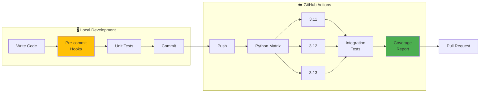

# Testing Framework

This directory contains the comprehensive test suite for the Multi-Modal Neural Network project.

**Current Status:** 14/14 acceptance-gate tests passing; broader test-suite guidance is documented below.

## Test Pipeline Overview



## Test Structure

```
tests/
├── conftest.py              # Pytest configuration and shared fixtures
├── test_models.py           # Tests for model components
├── test_training.py         # Tests for training utilities
├── test_data.py             # Tests for data pipeline
├── test_integration.py      # End-to-end integration tests (28 tests)
├── test_gpu_utils.py        # GPU detection and configuration tests
├── test_npu_utils.py        # NPU detection tests
├── test_safe_load.py        # Checkpoint loading tests
├── acceptance/              # Acceptance tests and ATDD gate docs
└── ...                      # Additional test modules
```

## Running Tests

### Quick Start (Recommended)

Use the Makefile for common testing tasks:
```bash
# Run all tests
make test

# Run tests with coverage
make test-cov
```

### Acceptance Gate

Run the sprint acceptance gate explicitly:
```bash
pytest tests/acceptance/test_sprint_thread_tdd_red.py -m "acceptance and tdd_red" -q
```

### Shell Scripts

Run all unit tests (excluding slow and integration tests):
```bash
# Linux/Mac
./run_tests.sh

# Windows
.\run_tests.ps1
```

### Test Categories

**Unit Tests** (fast, run frequently):
```bash
./run_tests.sh --unit
```

**Integration Tests** (slower, more comprehensive):
```bash
./run_tests.sh --integration
```

**All Tests** (including slow tests):
```bash
./run_tests.sh --all --slow
```

### Coverage Reports

Run tests with coverage analysis:
```bash
./run_tests.sh --coverage
```

This generates:
- Terminal coverage summary
- HTML report in `htmlcov/index.html`

### Custom Test Selection

Run specific test markers:
```bash
# Run only model tests
pytest -m model

# Run all except GPU tests
pytest -m "not gpu"

# Run fast unit tests
pytest -m "unit and not slow"
```

Run specific test files:
```bash
pytest tests/test_models.py
pytest tests/test_training.py::TestLossFunctions
pytest tests/test_integration.py::TestEndToEndTraining::test_complete_training_step
```

## Test Markers

Tests are organized with pytest markers:

- `@pytest.mark.unit` - Fast unit tests
- `@pytest.mark.integration` - Integration tests
- `@pytest.mark.slow` - Tests that take longer to run
- `@pytest.mark.gpu` - Tests requiring GPU
- `@pytest.mark.model` - Model component tests
- `@pytest.mark.data` - Data pipeline tests
- `@pytest.mark.training` - Training utility tests
- `@pytest.mark.acceptance` - Sprint acceptance-gate tests
- `@pytest.mark.tdd_red` - Acceptance tests originally written in the RED phase of ATDD/TDD and now expected to pass in the green acceptance gate

## Available Fixtures

The `conftest.py` file provides shared fixtures:

### Device Fixtures
- `device`: CPU or CUDA device
- `cpu_device`: Force CPU device

### Configuration Fixtures
- `model_config`: Default model configuration
- `small_model_config`: Smaller model for faster tests

### Data Fixtures
- `batch_size`: Default batch size
- `num_classes`: Number of classification classes
- `hidden_dim`: Hidden dimension size
- `sample_images`: Random image tensor
- `sample_text_inputs`: Random text input IDs
- `sample_attention_mask`: Attention mask tensor

### Temporary Directory Fixtures
- `temp_data_dir`: Temporary directory for test data
- `temp_output_dir`: Temporary directory for outputs
- `temp_checkpoint_dir`: Temporary directory for checkpoints

All temporary directories are automatically cleaned up after tests.

## Test Coverage

### Model Tests (`test_models.py`)
- Vision encoder (ViT) functionality
- Text encoder (BERT) functionality
- Fusion layer operations
- Double-loop controller
- Task heads
- Full model integration
- Parameter freezing/unfreezing
- Gradient flow verification

### Training Tests (`test_training.py`)
- Loss functions (cross-entropy, contrastive, focal, multi-task, meta)
- Optimizer creation and configuration
- Learning rate schedulers
- Gradient clipping
- Gradient accumulation equivalence
- Warmup and cosine annealing schedules
- Training loop components

### Data Tests (`test_data.py`)
- Image transformations and augmentation
- Dataset creation and loading
- Batch collation
- COCO Captions dataset
- ImageNet dataset
- Data loader creation
- Data pipeline performance

### Integration Tests (`test_integration.py`)
- End-to-end training steps
- Full training epochs
- Checkpoint saving and loading
- Model inference
- GPU training (if available)
- Mixed precision training
- Multi-task learning
- Double-loop learning

## Writing New Tests

### Basic Test Structure

```python
import pytest
from src.models import create_multi_modal_model

def test_example(model_config):
    """Test description."""
    model = create_multi_modal_model(model_config)
    # Your test code here
    assert condition
```

### Using Fixtures

```python
def test_with_sample_data(sample_images, sample_text_inputs, model_config):
    """Test with sample data."""
    model = create_multi_modal_model(model_config)
    outputs = model(sample_images, sample_text_inputs)
    assert outputs is not None
```

### Marking Tests

```python
@pytest.mark.slow
@pytest.mark.gpu
def test_gpu_training(model_config):
    """Test that requires GPU and takes time."""
    if not torch.cuda.is_available():
        pytest.skip("CUDA not available")
    # Your test code here
```

### Temporary Files

```python
def test_with_temp_files(temp_output_dir):
    """Test that needs temporary directory."""
    output_file = temp_output_dir / "test_output.pt"
    torch.save(data, output_file)
    assert output_file.exists()
    # Cleanup happens automatically
```

## Continuous Integration

Tests are designed to work in CI environments:

1. **Fast feedback**: Unit tests run in < 1 minute
2. **Staged testing**: Separate unit and integration test stages
3. **GPU optional**: Tests skip GPU tests when CUDA unavailable
4. **Deterministic**: Fixed random seeds for reproducibility
5. **Clean state**: Each test is isolated with fixtures
6. **Multi-version testing**: CI runs Python 3.11, 3.12, and 3.13
7. **Coverage reporting**: Automatic coverage reports on pull requests

### GitHub Actions Workflow

The project uses `.github/workflows/tests.yml` for CI/CD:

```yaml
# Key features:
# - Multi-version Python matrix (3.11, 3.12, 3.13)
# - Dependency caching for fast builds
# - Coverage reporting
# - Pre-commit hook validation
```

### Pre-commit Hooks

Install pre-commit hooks for local development:
```bash
pip install pre-commit
pre-commit install
```

Hooks run automatically on commit:
- **ruff**: Fast linting and formatting
- **bandit**: Security vulnerability scanning
- **pytest**: Quick test validation

## Troubleshooting

### Import Errors
If you see import errors, install the package in development mode:
```bash
pip install -e .
```

### GPU Tests Failing
GPU tests automatically skip when CUDA is unavailable. To force skip:
```bash
pytest -m "not gpu"
```

### Slow Tests
Skip slow tests for faster iteration:
```bash
pytest -m "not slow"
```

### Memory Issues
For memory-constrained environments, use smaller batch sizes:
```bash
pytest --override-ini="batch_size=2"
```

## Best Practices

1. **Keep tests fast**: Use small models and datasets in unit tests
2. **Test one thing**: Each test should verify a single behavior
3. **Use fixtures**: Reuse common setup code via fixtures
4. **Clear names**: Test names should describe what they verify
5. **Add markers**: Mark slow, GPU, or integration tests appropriately
6. **Clean state**: Don't rely on test execution order
7. **Mock external dependencies**: Use mocks for APIs, databases, etc.

## Resources

- [pytest documentation](https://docs.pytest.org/)
- [pytest fixtures](https://docs.pytest.org/en/latest/fixture.html)
- [pytest markers](https://docs.pytest.org/en/latest/mark.html)
- [Coverage.py](https://coverage.readthedocs.io/)

## ATDD Red-Green Workflow (Sprint Thread)

Before feature implementation, run RED-phase acceptance tests:

```bash
pytest tests/acceptance/test_sprint_thread_tdd_red.py -m "acceptance and tdd_red"
```

Expected outcome in RED phase: failing tests that define required behavior.
After implementation, rerun until fully green.

